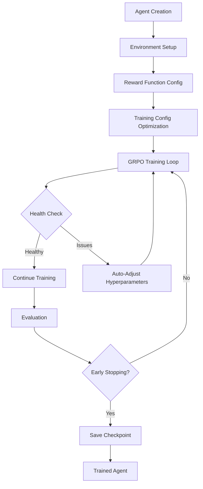
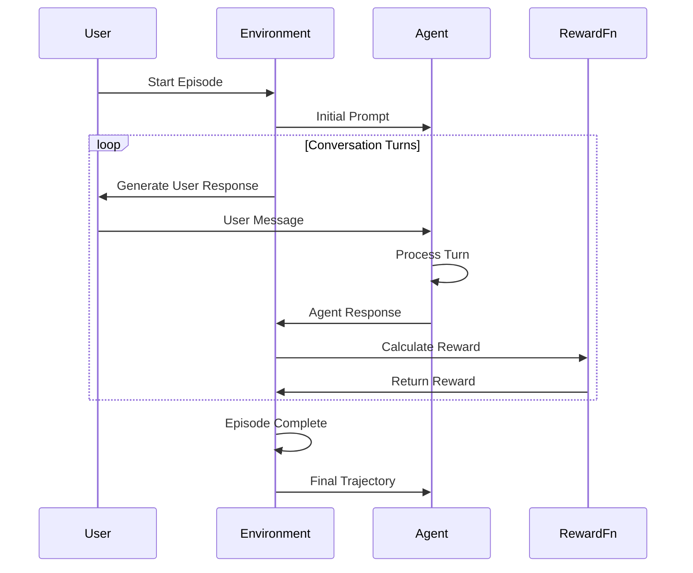

# GRPO Agent Framework - Complete Overview

## 🚀 What We've Built

The **GRPO Agent Framework** is a comprehensive library for training multi-turn conversational AI agents using **Group Relative Policy Optimization (GRPO)**. This framework transforms the advanced GRPO techniques we developed into a production-ready, extensible platform for building sophisticated conversational agents.

## 📋 Framework Architecture

### Core Components

```
stateset_agents/
├── core/                    # Core abstractions and interfaces
│   ├── agent.py            # Agent base classes and implementations
│   ├── environment.py      # Training environments and scenarios
│   ├── trajectory.py       # Conversation data structures
│   └── reward.py           # Reward modeling framework
├── training/               # Training infrastructure
│   ├── trainer.py          # GRPO training implementation
│   ├── config.py           # Configuration management
│   ├── diagnostics.py      # Training health monitoring
│   └── train.py            # High-level training interface
├── examples/               # Complete usage examples
│   ├── quick_start.py      # Basic framework introduction
│   └── customer_service_agent.py  # Advanced example
├── utils/                  # Utilities and helpers
├── tests/                  # Comprehensive test suite
└── docs/                   # Documentation
```

## 🎯 Key Features

### 1. **Multi-Turn Conversation Support**
- Native support for extended dialogues
- Conversation state management
- Context compression and memory windows
- Turn-by-turn reward calculation

### 2. **Flexible Agent Architecture**
```python
# Base agent classes
Agent                    # Abstract base for all agents
MultiTurnAgent          # Specialized for conversations
ToolAgent              # Can use external tools/functions

# Easy customization
class MyAgent(MultiTurnAgent):
    async def process_turn(self, history, user_input, context):
        # Custom logic here
        return await super().process_turn(history, user_input, context)
```

### 3. **Rich Environment System**
```python
# Built-in environments
ConversationEnvironment  # Open-ended conversations
TaskEnvironment         # Goal-oriented interactions

# Easy to extend
class CustomEnvironment(Environment):
    async def step(self, state, action):
        # Custom environment logic
        return new_state, response, reward, done
```

### 4. **Composable Reward Functions**
```python
# Pre-built rewards
HelpfulnessReward(weight=0.4)
SafetyReward(weight=0.3)
CorrectnessReward(weight=0.2)
EngagementReward(weight=0.1)

# Combine easily
composite_reward = CompositeReward([
    HelpfulnessReward(weight=0.4),
    SafetyReward(weight=0.3),
    CustomReward(weight=0.3)
])

# Custom rewards with decorators
@reward_function(weight=0.5)
async def politeness_reward(turns, context=None):
    # Custom reward logic
    return score
```

### 5. **Automatic Training Optimization**
```python
# Auto-configuration based on task analysis
auto_trainer = AutoTrainer(auto_adjust=True)
trained_agent = await auto_trainer.train(agent, environment)

# Built-in best practices
profiles = {
    "conservative": "Maximum stability",
    "balanced": "Good stability + performance", 
    "aggressive": "Maximum performance"
}
```

### 6. **Comprehensive Monitoring**
- Real-time training health diagnostics
- Reward diversity tracking
- Automatic hyperparameter adjustment
- Early stopping and checkpointing
- Weights & Biases integration

## 🔧 Usage Examples

### Quick Start
```python
import asyncio
from stateset_agents import MultiTurnAgent, ConversationEnvironment, train

async def main():
    # 1. Create agent
    agent = MultiTurnAgent.from_model("openai/gpt-oss-120b")
    
    # 2. Create environment
    scenarios = [{"user_responses": ["Hi!", "How are you?", "Thanks!"]}]
    env = ConversationEnvironment(scenarios=scenarios)
    
    # 3. Train
    trained_agent = await train(agent, env, num_episodes=1000)
    
    # 4. Use
    response = await trained_agent.generate_response([
        {"role": "user", "content": "Hello!"}
    ])
    print(f"Agent: {response}")

asyncio.run(main())
```

### Advanced Customer Service Agent
```python
from stateset_agents.examples import CustomerServiceAgent

# Specialized agent with domain knowledge
agent = CustomerServiceAgent("openai/gpt-oss-120b")

# Custom environment with realistic scenarios
env = CustomerServiceEnvironment()

# Domain-specific rewards
reward_fn = create_customer_service_reward()

# Train with monitoring
trained_agent = await train(
    agent=agent,
    environment=env,
    reward_fn=reward_fn,
    profile="balanced",
    auto_adjust=True
)
```

## 🎛️ Command Line Interface

### Training
```bash
# Simple training
grpo-train configs/my_agent.yaml

# Advanced training with monitoring
grpo-train configs/customer_service.yaml \
  --model-name openai/gpt-oss-120b \
  --num-episodes 2000 \
  --profile aggressive \
  --auto-adjust \
  --wandb-project my-experiments
```

### Evaluation
```bash
# Evaluate trained agent
grpo-evaluate ./checkpoints/my_agent \
  --num-episodes 100 \
  --scenarios-file test_scenarios.json \
  --output-file results.json
```

### Deployment
```bash
# Serve agent via REST API
grpo-serve ./checkpoints/my_agent \
  --host 0.0.0.0 \
  --port 8000 \
  --auth-token my-secret
```

## 🏗️ Architecture Principles

### 1. **Modular Design**
Every component is designed to be independently replaceable:
- Swap agents without changing environments
- Mix and match reward functions
- Plug in custom training configurations

### 2. **Async-First**
Built for modern Python with full async/await support:
- Non-blocking training loops
- Concurrent trajectory generation
- Scalable conversation handling

### 3. **Best Practices Built-In**
Incorporates research-backed techniques:
- GRPO algorithm implementation
- Reward diversity monitoring
- Stability diagnostics
- Automatic hyperparameter tuning

### 4. **Production Ready**
Designed for real-world deployment:
- REST API serving
- Health monitoring
- Conversation logging
- Authentication support

## 📊 Training Flow



## 🔄 Conversation Flow



## 🎯 Use Cases

### 1. **Customer Service Agents**
- Handle support tickets
- Provide product information
- Escalate complex issues
- Maintain professional tone

### 2. **Educational Tutors**
- Adapt to student level
- Provide step-by-step explanations
- Track learning progress
- Encourage engagement

### 3. **Task-Oriented Assistants**
- Complete multi-step workflows
- Gather required information
- Execute tool functions
- Report progress

### 4. **Creative Assistants**
- Generate creative content
- Collaborate on ideas
- Provide inspiration
- Maintain creative flow

## 🚀 Advanced Features

### 1. **Tool Integration**
```python
tools = [
    {"name": "calculator", "function": calculate},
    {"name": "search", "function": web_search},
    {"name": "calendar", "function": schedule_meeting}
]

tool_agent = ToolAgent(config, tools=tools)
```

### 2. **Multi-GPU Training**
```python
trainer = DistributedTrainer(num_gpus=4, strategy="ddp")
await trainer.train(agent, environment, config)
```

### 3. **Real-time Diagnostics**
```python
monitor = DiagnosticsMonitor()
health = monitor.get_health_status()
# Auto-adjust based on health metrics
```

### 4. **Custom Reward Functions**
```python
class DomainReward(RewardFunction):
    async def compute_reward(self, turns, context=None):
        # Domain-specific evaluation logic
        return RewardResult(score=score, breakdown=breakdown)
```

## 📈 Performance Characteristics

### Training Efficiency
- **Memory Efficient**: Gradient accumulation and checkpointing
- **Scalable**: Multi-GPU support with various strategies
- **Adaptive**: Auto-adjusting hyperparameters based on training health

### Conversation Quality
- **Coherent**: Multi-turn context preservation
- **Safe**: Built-in safety reward functions
- **Engaging**: Reward functions for conversation quality

### Production Ready
- **Fast Inference**: Optimized generation pipeline
- **Reliable**: Health monitoring and automatic recovery
- **Scalable**: Concurrent conversation handling

## 🔧 Extension Points

### Custom Agents
```python
class SpecializedAgent(MultiTurnAgent):
    def __init__(self, domain_knowledge):
        super().__init__(config)
        self.knowledge = domain_knowledge
    
    async def process_turn(self, history, user_input, context):
        # Inject domain knowledge
        enhanced_context = self.enhance_with_knowledge(context)
        return await super().process_turn(history, user_input, enhanced_context)
```

### Custom Environments
```python
class SimulatedEnvironment(Environment):
    def __init__(self, simulator):
        self.simulator = simulator
    
    async def step(self, state, action):
        # Use external simulator
        result = self.simulator.process(state, action)
        return self.convert_to_trajectory(result)
```

### Custom Rewards
```python
@reward_function(weight=0.3)
async def business_metric_reward(turns, context=None):
    # Evaluate against business KPIs
    return calculate_business_value(turns, context)
```

## 📚 Documentation

### Complete Guides
- **[README.md](README.md)**: Project overview and installation
- **[USAGE_GUIDE.md](USAGE_GUIDE.md)**: Comprehensive usage instructions  
- **[CLI_REFERENCE.md](CLI_REFERENCE.md)**: Command-line tool documentation
- **[GRPO_BEST_PRACTICES.md](../GRPO_BEST_PRACTICES.md)**: Research-backed training guidelines

### Examples
- **[Quick Start](examples/quick_start.py)**: Basic framework introduction
- **[Customer Service Agent](examples/customer_service_agent.py)**: Production-ready example
- **[API Documentation](docs/api/)**: Complete API reference

## 🤝 Contributing

The framework is designed to be extensible:

1. **Add New Agent Types**: Inherit from base classes
2. **Create Custom Environments**: Implement Environment interface  
3. **Design Reward Functions**: Use RewardFunction base class
4. **Contribute Examples**: Show real-world usage patterns

## 🏆 What Makes This Special

### 1. **Research Integration**
- Implements cutting-edge GRPO algorithm
- Incorporates empirical best practices
- Automatic stability monitoring

### 2. **Production Focus** 
- Full async/await support
- REST API serving
- Health monitoring
- Authentication

### 3. **Developer Experience**
- Intuitive APIs
- Comprehensive examples
- Clear documentation
- CLI tools

### 4. **Extensibility**
- Modular architecture
- Clear extension points
- Plugin system design

## 🎯 Impact

This framework transforms research into practice by:

1. **Democratizing GRPO**: Makes advanced RL techniques accessible
2. **Standardizing Multi-turn Training**: Provides consistent patterns
3. **Enabling Rapid Prototyping**: Quick agent development and testing
4. **Supporting Production Deployment**: Production-ready serving infrastructure

## 🚀 Next Steps

### Immediate Usage
1. **Install**: `pip install grpo-agent-framework`
2. **Try Examples**: Run the quick start guide
3. **Explore**: Check out the customer service example
4. **Customize**: Build your own agents and environments

### Advanced Development
1. **Extend**: Create custom components
2. **Integrate**: Add to existing systems
3. **Scale**: Deploy with multi-GPU training
4. **Monitor**: Use built-in diagnostics

### Community
1. **Share**: Contribute examples and use cases
2. **Improve**: Submit bug reports and feature requests
3. **Collaborate**: Join the development community

---

**The GRPO Agent Framework represents the evolution from research prototype to production-ready platform, enabling anyone to build sophisticated multi-turn conversational agents with state-of-the-art reinforcement learning techniques.** 🚀