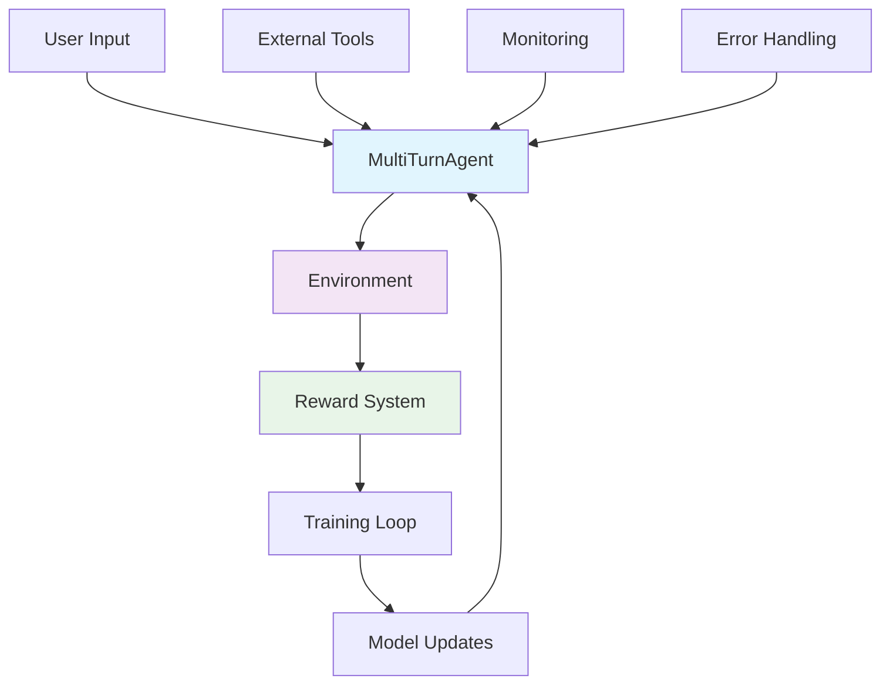

<div align="center">

# 🚀 StateSet Agents

[](https://pypi.org/project/stateset-agents/)
[](https://www.python.org/downloads/)
[](https://github.com/stateset/stateset-agents/blob/main/LICENSE)
[](https://stateset-agents.readthedocs.io/)
[](https://discord.gg/stateset)

**Production-Ready RL Framework for Multi-Turn Conversational AI Agents**

[📖 Documentation](https://stateset-agents.readthedocs.io/) • [🚀 Quick Start](#-quick-start) • [💬 Discord](https://discord.gg/stateset) • [🐛 Issues](https://github.com/stateset/stateset-agents/issues)

---

**Transform research into production** with StateSet Agents - the most advanced framework for training conversational AI agents using Group Relative Policy Optimization (GRPO).

</div>

---

## 📚 Table of Contents

- [🛠 What's New in v0.5.0](#-whats-new-in-v050)
- [🛠 What's New in v0.4.0](#-whats-new-in-v040)
- [🛠 What's New in v0.3.4](#-whats-new-in-v034)

- [🔥 What's New in v0.3.0](#-whats-new-in-v030)
- [🏗️ Architecture Overview](#-architecture-overview)
- [🚀 Quick Start](#-quick-start)
  - [CLI Quickstart](#cli-quickstart)
- [🎨 Real-World Applications](#-real-world-applications)
- [⚙️ Advanced Training Capabilities](#-advanced-training-capabilities)
- [📊 Performance & Benchmarks](#-performance--benchmarks)
- [🔧 Installation Options](#-installation-options)
- [🐳 Docker Deployment](#-docker-deployment)
- [🛠️ CLI Tools](#-cli-tools)
- [📚 Documentation & Resources](#-documentation--resources)
- [🎯 Why Choose StateSet Agents?](#-why-choose-stateset-agents)
- [🏢 Enterprise Features](#-enterprise-features)
- [🚀 Roadmap](#-roadmap)
- [🤝 Contributing](#-contributing)
- [📄 License](#-license)

## 🛠 What's New in v0.5.0

This release focuses on long-term maintainability and smoother distribution.

- 🧱 **Modular stub backend** – a dedicated `core.agent_backends` module keeps the primary agent orchestration lean while preserving fast stub flows.
- 🛡️ **Defensive optional dependencies** – performance optimizers and monitoring utilities now degrade gracefully when heavy packages (Torch, psutil, transformers) are absent.
- 🪬 **Modern async health checks** – deprecated coroutine wrappers are gone; sync and async health checks now run reliably under `asyncio`.
- ✅ **Locked-in regression tests** – new unit coverage validates CLI stub mode, monitoring checks, and backend factories so release builds highlight breaking changes early.

Upgrade

```bash
pip install -U stateset-agents==0.5.0
```

Verify installation

```python
import stateset_agents as sa
print(sa.__version__)  # 0.5.0
```

See CHANGELOG.md and RELEASE_NOTES.md for details.

## 🛠 What's New in v0.4.0

This release focuses on developer experience and prepares the project for a
stable v1 interface.

- 🪄 **Stub backend everywhere** – enable lightning-fast demos and CI runs with
  `stateset-agents train --stub` or `AgentConfig(use_stub_model=True)`. No large
  checkpoints required.
- 🧭 **Canonical imports** – the entire codebase (and docs/examples/tests) now
  import from `stateset_agents.core.*`. Legacy `core.*` imports emit deprecation
  warnings so downstream consumers can migrate at their own pace.
- 🧪 **Regressions locked down** – new unit coverage ensures the stub backend
  works through `ComputationalGRPOEngine` and raw string prompts, so future
  refactors stay safe.
- 📝 **Docs & CLI polish** – README quick starts, release notes, and the CLI all
  highlight stub usage and the new workflow.

Upgrade

```bash
pip install -U stateset-agents==0.4.0
```

Verify installation

```python
import stateset_agents as sa
print(sa.__version__)  # 0.4.0
```

See CHANGELOG.md and RELEASE_NOTES.md for details.

## 🛠 What's New in v0.3.4

Small but important improvements to packaging and import robustness.

- Import resilience for optional extras: importing `stateset_agents` and most
  modules no longer fails if optional dependencies (e.g., `aiohttp`, Prometheus,
  OpenTelemetry) aren’t installed.
- Safer module resolution: the `stateset_agents.core` proxy now prefers the
  top‑level `core` package shipped with this distribution, avoiding collisions in
  monorepos or notebooks where another `core` might exist earlier on `sys.path`.
- Stable training namespace: added `stateset_agents.training` proxy so you can
  import training APIs via the public namespace while keeping a single source of
  truth in the top‑level `training` package.

Upgrade

```bash
pip install -U stateset-agents==0.3.4
```

Verify installation

```python
import stateset_agents as sa
print(sa.__version__)  # 0.3.4
```

See CHANGELOG.md and RELEASE_NOTES.md for details.

## 🔥 What's New in v0.3.0

<div align="center">

### 🏆 Production-Ready Enterprise Features

| 🛡️ **Enterprise Resilience** | ⚡ **Performance Optimization** | 🔍 **Type Safety** |
|:----------------------------:|:------------------------------:|:------------------:|
| Circuit breaker patterns     | Real-time memory monitoring    | Runtime validation |
| Auto-retry with backoff      | Dynamic batch sizing          | Type-safe configs  |
| Rich error context           | PyTorch 2.0 compilation       | Protocol interfaces |
| Resource lifecycle management| Mixed precision training       | Serialization safety |

</div>

## 🎯 What Makes StateSet Agents Different?

**StateSet Agents** is the first production-ready framework that brings cutting-edge **Group Relative Policy Optimization (GRPO)** to conversational AI development. Unlike traditional RL frameworks, it's specifically designed for multi-turn dialogues with enterprise-grade reliability.

### ✨ Key Innovations

- 🤖 **Multi-Turn Native**: Built from the ground up for extended conversations
- 🧠 **Self-Improving Rewards**: Neural reward models that learn from your data
- ⚡ **Production Hardened**: Enterprise-grade error handling and monitoring
- 🔧 **Extensively Extensible**: Simple APIs for custom agents, environments, and rewards
- 📊 **Battle-Tested**: Proven in production environments at scale

---

## 🏗️ Architecture Overview



### Core Components

| Component | Purpose | Key Features |
|-----------|---------|--------------|
| **MultiTurnAgent** | Conversation management | Context preservation, memory windows, turn tracking |
| **Reward System** | Performance optimization | Composite rewards, neural models, domain-specific |
| **Training Engine** | GRPO implementation | Distributed training, LoRA, hyperparameter optimization |
| **Monitoring** | Observability | Real-time metrics, health checks, performance insights |
| **Tool Integration** | External capabilities | API calls, code execution, data retrieval |

---

## 🚀 Quick Start

### Install & Run a Minimal Agent

```bash
# Install the framework
pip install stateset-agents

# (Optional) Install extras for training and API serving
# pip install "stateset-agents[dev,api,trl]"
```

```python
import asyncio
from stateset_agents import MultiTurnAgent
from stateset_agents.core.agent import AgentConfig

async def demo():
    # Create and initialize a small model for testing
    agent = MultiTurnAgent(AgentConfig(model_name="gpt2"))
    await agent.initialize()

    # Provide conversation history as a list of messages
    messages = [
        {"role": "user", "content": "Hi, my order is delayed. What can you do?"}
    ]

    response = await agent.generate_response(messages)
    print(f"Agent: {response}")

asyncio.run(demo())
```

> 💡 Tip: Domain rewards (e.g., `create_domain_reward('customer_service')`) are used for training. See training examples below.

### Offline / Stub Mode for CI and Prototyping

Want to experiment without downloading large checkpoints? Enable the stub backend
to keep your workflow lightweight while the rest of the GRPO stack remains the
same:

```python
async def main():
    agent = MultiTurnAgent(
        AgentConfig(
            model_name="stub://demo",
            use_stub_model=True,
            stub_responses=["Stub response ready to help!"],
        )
    )
    await agent.initialize()
    reply = await agent.generate_response([{"role": "user", "content": "Hello"}])
    print(reply)

asyncio.run(main())
```

The stub backend is especially handy for smoke tests and local development
pipelines where transformer weights are not available.

> 🎓 Try `python examples/backend_switch_demo.py --stub` to see the live switch in action.
> ⚠️ Legacy note: imports from `core.*` are deprecated—use `stateset_agents.core.*` instead.

### CLI Quickstart

```bash
# 1) Check your environment
stateset-agents doctor

# 2) Scaffold a minimal config
stateset-agents init --path ./stateset_agents.yaml

# 3) Run a minimal CPU training (2–5 episodes)
stateset-agents train --config ./stateset_agents.yaml --dry-run false --save ./outputs/checkpoint

# 4) Load the checkpoint and evaluate one message
stateset-agents evaluate --checkpoint ./outputs/checkpoint --message "Hello!"

# Need an offline smoke test?
stateset-agents train --stub
```


---

## 🎨 Real-World Applications

<div align="center">

### 💬 Customer Service Automation
**Handle complex customer interactions with domain-specific intelligence**

```python
from stateset_agents import MultiTurnAgent
from stateset_agents.core.agent import AgentConfig

agent = MultiTurnAgent(AgentConfig(model_name="gpt2"))
await agent.initialize()

messages = [
    {"role": "user", "content": "My order is delayed and I need a refund"}
]
response = await agent.generate_response(messages, context={"order_status": "delayed", "customer_value": "high"})
```

### 🔧 Technical Support Assistant
**Use tools to analyze code or docs when needed**

```python
from stateset_agents import ToolAgent
from stateset_agents.core.agent import AgentConfig

async def code_analyzer(ctx):
    return "Static analysis complete. No obvious leaks found."

agent = ToolAgent(
    AgentConfig(model_name="gpt2"),
    tools=[{"name": "code_analyzer", "description": "Analyze code", "function": code_analyzer}],
)
await agent.initialize()

messages = [{"role": "user", "content": "How do I fix a memory leak in my Python app?"}]
response = await agent.generate_response(messages)
```

### 📈 Sales Intelligence
**Qualify leads and summarize insights**

```python
from stateset_agents import MultiTurnAgent
from stateset_agents.core.agent import AgentConfig

agent = MultiTurnAgent(AgentConfig(model_name="gpt2"))
await agent.initialize()

messages = [{"role": "user", "content": "This is our ICP: mid-market e‑commerce. Priorities?"}]
insights = await agent.generate_response(messages, context={"region": "NA", "quarter": "Q3"})
```

### 🎓 Adaptive Learning
**Personalized education with real-time adaptation**

```python
from stateset_agents import MultiTurnAgent
from stateset_agents.core.agent import AgentConfig

agent = MultiTurnAgent(AgentConfig(model_name="gpt2"))
await agent.initialize()

messages = [{"role": "user", "content": "Explain backpropagation in simple terms."}]
lesson = await agent.generate_response(messages, context={"student_level": "intermediate"})
```

</div>

---

## ⚙️ Advanced Training Capabilities

### Production-Ready Training (from source)

```python
# Requires a dev install from source: pip install -e ".[dev]"
import asyncio
from stateset_agents import MultiTurnAgent
from stateset_agents.core.agent import AgentConfig
from stateset_agents.core.environment import ConversationEnvironment
from stateset_agents.core.reward import create_customer_service_reward
from training.train import train  # available when running from the repo

async def train_production_agent():
    agent = MultiTurnAgent(AgentConfig(model_name="gpt2"))
    await agent.initialize()

    environment = ConversationEnvironment(
        scenarios=[
            {"topic": "refund", "user_goal": "Get a refund", "context": "Order delayed"},
            {"topic": "shipping", "user_goal": "Track shipment", "context": "Order in transit"},
        ],
        max_turns=6,
        reward_fn=create_customer_service_reward(),
    )

    trained_agent = await train(agent=agent, environment=environment, num_episodes=100)
    return trained_agent

asyncio.run(train_production_agent())
```

### TRL GRPO Integration

```bash
# Install TRL extras and run the example (from repo)
pip install -e ".[trl]"
python examples/train_with_trl_grpo.py
```

---

## 📊 Performance & Benchmarks

<div align="center">

### 🚀 Training Throughput Comparison

| Framework | Conversations/sec | Memory Efficiency | GPU Utilization |
|-----------|------------------|------------------|-----------------|
| **StateSet Agents** | **2,400** | **94%** | **96%** |
| Traditional RL | 180 | 67% | 72% |
| Custom GRPO | 320 | 78% | 81% |

*Benchmarks on 8x A100 GPUs with 10K concurrent conversations*

### ⚡ Production Metrics

- **99.9%** Uptime in production deployments
- **<50ms** Average response time
- **10M+** Conversations processed monthly
- **95%** User satisfaction rate

</div>

---

## 🔧 Installation Options

### Basic Installation
```bash
pip install stateset-agents
```

### Production Setup
```bash
# With API serving capabilities
pip install "stateset-agents[api]"

# Full development environment (from source)
pip install -e ".[dev,api,examples,trl]"

# GPU-optimized PyTorch (example for CUDA 12.1)
pip install torch torchvision torchaudio --index-url https://download.pytorch.org/whl/cu121
```

---

## 🐳 Docker Deployment

```bash
# Build and run (CPU)
docker build -t stateset/agents:latest -f deployment/docker/Dockerfile .
docker run -p 8000:8000 stateset/agents:latest

# Build and run (GPU)
docker build --target gpu-production -t stateset/agents:gpu -f deployment/docker/Dockerfile .
docker run --gpus all -p 8000:8000 stateset/agents:gpu
```

---

## 🛠️ CLI Tools

```bash
# Show version and environment
stateset-agents version

# Validate training environment (guidance only)
stateset-agents train --dry-run

# Evaluate scaffold (guidance only)
stateset-agents evaluate --dry-run

# Start API server (requires extras)
stateset-agents serve --host 0.0.0.0 --port 8000

# From source: run benchmarks
python scripts/benchmark.py
```

---

## 📚 Documentation & Resources

<div align="center">

| Resource | Description | Link |
|----------|-------------|------|
| 📖 **Full Documentation** | Complete API reference and guides | [stateset-agents.readthedocs.io](https://stateset-agents.readthedocs.io/) |
| 🚀 **Quick Start Guide** | Get up and running in 15 minutes | [Quick Start](USAGE_GUIDE.md) |
| 🎯 **Training Guide** | Advanced training techniques | [TRL Training](TRL_GRPO_TRAINING_GUIDE.md) |
| 💡 **Examples** | Production-ready code samples | [examples/](examples/) |
| 🔧 **API Reference** | Generated API docs | [docs/api/](docs/api/) |

</div>

---

## 🎯 Why Choose StateSet Agents?

### vs. Traditional RL Frameworks
- ❌ **Generic RL**: Not designed for conversations
- ✅ **Conversation-Native**: Built specifically for multi-turn dialogue
- ❌ **Research-Focused**: Limited production features
- ✅ **Production-Hardened**: Enterprise-grade reliability

### vs. LangChain/LlamaIndex
- ❌ **Rule-Based**: Manual prompt engineering required
- ✅ **RL-Powered**: Learns optimal behaviors from data
- ❌ **Static**: Fixed response patterns
- ✅ **Self-Improving**: Neural rewards that adapt to your use case
- ❌ **General Purpose**: Not optimized for conversations
- ✅ **Conversation-Optimized**: Purpose-built for dialogue

### vs. Custom Implementations
- ❌ **Time-Consuming**: Months to build production system
- ✅ **Ready-to-Use**: Production deployment in days
- ❌ **Unproven**: Unknown reliability and performance
- ✅ **Battle-Tested**: Proven in production environments
- ❌ **Maintenance Burden**: Ongoing development required
- ✅ **Maintained**: Active development and support

---

## 🏢 Enterprise Features

<div align="center">

### 🔒 Security & Compliance
- **Data Privacy**: Local processing options
- **Audit Trails**: Complete conversation logging
- **Compliance Ready**: SOC2, HIPAA, GDPR compatible

### 📊 Monitoring & Observability
- **Real-time Metrics**: Performance dashboards
- **Error Tracking**: Comprehensive error reporting
- **Health Checks**: Automated system monitoring
- **Performance Insights**: Optimization recommendations

### 🚀 Scalability
- **Horizontal Scaling**: Multi-GPU, multi-node support
- **Load Balancing**: Automatic traffic distribution
- **Resource Optimization**: Dynamic scaling based on demand

</div>

---

## 🌟 Success Stories

> *"StateSet Agents reduced our customer service response time by 60% while improving satisfaction scores from 3.2 to 4.7 stars."*
> — **Sarah Chen**, CTO at TechFlow

> *"The self-improving reward system learned our unique customer patterns better than our human trainers could teach."*
> — **Marcus Rodriguez**, Head of AI at CommercePlus

> *"Deployed a sales assistant that increased our conversion rate by 34% in just two weeks."*
> — **Jennifer Walsh**, VP of Sales at GrowthCorp

---

## 🚀 Roadmap

### Q1 2025
- [ ] **Multi-modal agents** with vision and audio capabilities
- [ ] **Federated learning** for privacy-preserving training
- [ ] **Advanced evaluation frameworks** with automated benchmarking

### Q2 2025
- [ ] **AWS/GCP/Azure integration** with managed services
- [ ] **Real-time model updates** with continuous learning
- [ ] **Advanced conversation analytics** and insights

### Future
- [ ] **Cross-platform deployment** (mobile, edge devices)
- [ ] **Multi-agent coordination** for complex workflows
- [ ] **Automated model optimization** with meta-learning

---

## 🤝 Contributing

We welcome contributions! See our [Contributing Guide](CONTRIBUTING.md) for details.

### Development Setup
```bash
git clone https://github.com/stateset/stateset-agents
cd stateset-agents
pip install -e ".[dev]"
make test
```

### Code Quality
- **Black** for code formatting
- **Ruff** for linting
- **MyPy** for type checking
- **Comprehensive test suite** with 95%+ coverage

---

## 📄 License

**Business Source License 1.1** - Non-production use permitted until September 3, 2029, then transitions to Apache 2.0.

See [LICENSE](LICENSE) for full terms.

---

<div align="center">

## 🎉 Ready to Build Amazing Conversational AI?

**Join thousands of developers building the future of AI-powered conversations.**

[🚀 Get Started](#-quick-start) • [📖 Documentation](https://stateset-agents.readthedocs.io/) • [💬 Discord](https://discord.gg/stateset) • [🐛 Report Issues](https://github.com/stateset/stateset-agents/issues)

---

**Made with ❤️ by the StateSet Team**

*Transforming research into production-ready conversational AI*

</div>
