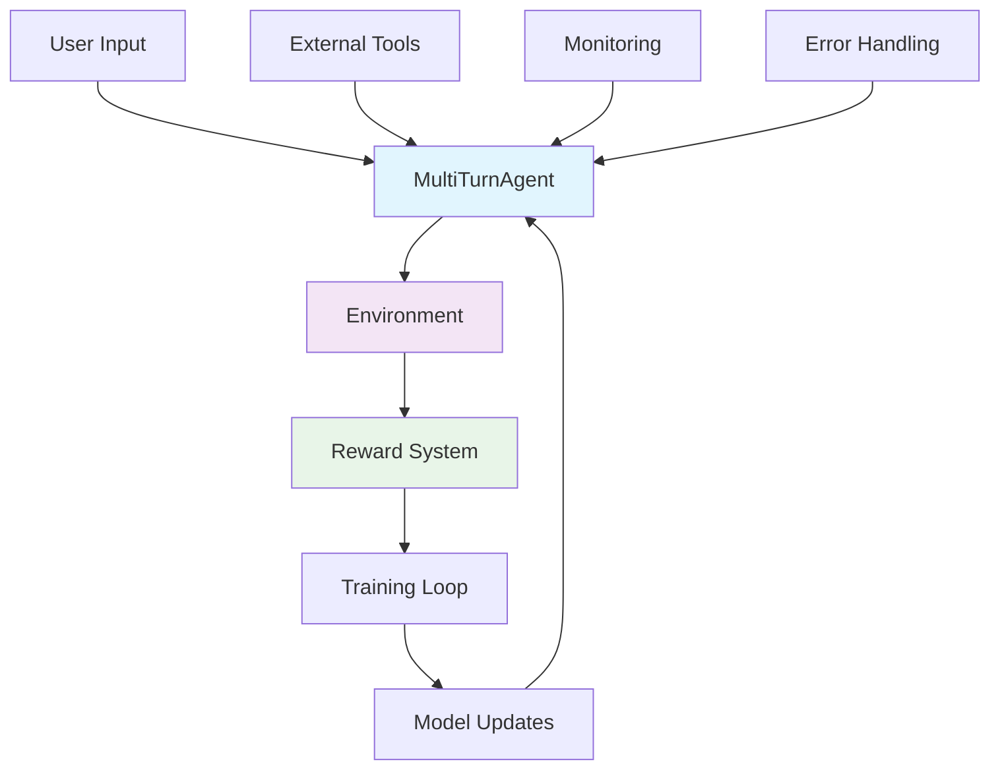

<div align="center">

# 🚀 StateSet Agents

[](https://pypi.org/project/stateset-agents/)
[](https://www.python.org/downloads/)
[](https://github.com/stateset/stateset-agents/actions)
[](https://github.com/stateset/stateset-agents)
[](https://github.com/stateset/stateset-agents/blob/main/LICENSE)
[](https://stateset-agents.readthedocs.io/)
[](https://discord.gg/stateset)

**Production-Ready RL Framework for Multi-Turn Conversational AI Agents**

[📖 Documentation](https://stateset-agents.readthedocs.io/) • [🚀 Quick Start](#-quick-start) • [💬 Discord](https://discord.gg/stateset) • [🐛 Issues](https://github.com/stateset/stateset-agents/issues)

---

**Transform research into production** with StateSet Agents - the most advanced framework for training conversational AI agents using Group Relative Policy Optimization (GRPO).

</div>

---

## 📚 Table of Contents

- [🛠 What's New in v0.5.0](#-whats-new-in-v050)
- [🛠 What's New in v0.4.0](#-whats-new-in-v040)
- [🛠 What's New in v0.3.4](#-whats-new-in-v034)

- [🔥 What's New in v0.3.0](#-whats-new-in-v030)
- [🏗️ Architecture Overview](#-architecture-overview)
- [🚀 Quick Start](#-quick-start)
  - [CLI Quickstart](#cli-quickstart)
- [🎨 Real-World Applications](#-real-world-applications)
- [⚙️ Advanced Training Capabilities](#-advanced-training-capabilities)
- [📊 Performance & Benchmarks](#-performance--benchmarks)
- [🔧 Installation Options](#-installation-options)
- [🐳 Docker Deployment](#-docker-deployment)
- [🛠️ CLI Tools](#-cli-tools)
- [📚 Documentation & Resources](#-documentation--resources)
- [🎯 Why Choose StateSet Agents?](#-why-choose-stateset-agents)
- [🏢 Enterprise Features](#-enterprise-features)
- [🚀 Roadmap](#-roadmap)
- [🤝 Contributing](#-contributing)
- [📄 License](#-license)

## 🛠 What's New in v0.6.0 (Current)

### 🌟 **GSPO Algorithm - Production Ready!**

We've implemented **Group Sequence Policy Optimization (GSPO)**, a state-of-the-art RL algorithm from Alibaba's Qwen Team that offers superior stability and efficiency compared to GRPO.

- 🎯 **Sequence-Level Optimization** – Uses sequence-level importance ratios for more stable training
- 🛡️ **No Model Collapse** – Prevents catastrophic failures even with long sequences and MoE models
- ⚡ **Better Efficiency** – Superior sample utilization despite higher clipping fractions
- 🔥 **Native MoE Support** – No need for Routing Replay or other workarounds
- 📊 **Proven Results** – Powers the latest Qwen3 models achieving SOTA performance
- 🔀 **GSPO-token Variant** – Token-level advantages for fine-grained control

**Quick GSPO Training:**

```python
from training.gspo_trainer import train_with_gspo, GSPOConfig

# Train with GSPO (more stable than GRPO!)
trained_agent = await train_with_gspo(
    config=gspo_config,
    agent=agent,
    environment=environment,
    reward_model=reward_model,
)
```

See `docs/GSPO_GUIDE.md` for complete documentation.

### 📈 **Automatic Hyperparameter Optimization (HPO)**

This release also adds comprehensive **automatic hyperparameter optimization** to help you find the best training configuration without manual tuning.

- 🎯 **Automatic HPO** – Built-in hyperparameter optimization using Optuna, Ray Tune, or W&B Sweeps
- 🔍 **Smart Search Spaces** – Pre-defined search spaces for GRPO, GSPO, domain-specific tasks, and training profiles
- ⚡ **Intelligent Pruning** – Early stopping of unpromising trials saves compute time
- 📊 **Rich Visualization** – Optimization history, parameter importance, and parallel coordinate plots
- 🚀 **One-Line HPO** – `quick_hpo()` function for instant hyperparameter search
- 🎨 **Domain Templates** – Specialized search spaces for customer service, technical support, sales

**Quick HPO Example:**

```python
from training.hpo import quick_hpo

summary = await quick_hpo(
    agent=agent,
    environment=environment,
    reward_function=reward_function,
    base_config=config,
    n_trials=50
)
print(f"Best params: {summary.best_params}")
```

Upgrade:

```bash
pip install -U stateset-agents[hpo]
```

See `docs/HPO_GUIDE.md` for complete documentation.

## 🛠 What's New in v0.5.0

This release focuses on long-term maintainability and smoother distribution.

- 🧱 **Modular stub backend** – a dedicated `core.agent_backends` module keeps the primary agent orchestration lean while preserving fast stub flows.
- 🛡️ **Defensive optional dependencies** – performance optimizers and monitoring utilities now degrade gracefully when heavy packages (Torch, psutil, transformers) are absent.
- 🪬 **Modern async health checks** – deprecated coroutine wrappers are gone; sync and async health checks now run reliably under `asyncio`.
- ✅ **Locked-in regression tests** – new unit coverage validates CLI stub mode, monitoring checks, and backend factories so release builds highlight breaking changes early.

Upgrade

```bash
pip install -U stateset-agents==0.5.0
```

Verify installation

```python
import stateset_agents as sa
print(sa.__version__)  # 0.5.0
```

See CHANGELOG.md and RELEASE_NOTES.md for details.

## 🛠 What's New in v0.4.0

This release focuses on developer experience and prepares the project for a
stable v1 interface.

- 🪄 **Stub backend everywhere** – enable lightning-fast demos and CI runs with
  `stateset-agents train --stub` or `AgentConfig(use_stub_model=True)`. No large
  checkpoints required.
- 🧭 **Canonical imports** – the entire codebase (and docs/examples/tests) now
  import from `stateset_agents.core.*`. Legacy `core.*` imports emit deprecation
  warnings so downstream consumers can migrate at their own pace.
- 🧪 **Regressions locked down** – new unit coverage ensures the stub backend
  works through `ComputationalGRPOEngine` and raw string prompts, so future
  refactors stay safe.
- 📝 **Docs & CLI polish** – README quick starts, release notes, and the CLI all
  highlight stub usage and the new workflow.

Upgrade

```bash
pip install -U stateset-agents==0.4.0
```

Verify installation

```python
import stateset_agents as sa
print(sa.__version__)  # 0.4.0
```

See CHANGELOG.md and RELEASE_NOTES.md for details.

## 🛠 What's New in v0.3.4

Small but important improvements to packaging and import robustness.

- Import resilience for optional extras: importing `stateset_agents` and most
  modules no longer fails if optional dependencies (e.g., `aiohttp`, Prometheus,
  OpenTelemetry) aren’t installed.
- Safer module resolution: the `stateset_agents.core` proxy now prefers the
  top‑level `core` package shipped with this distribution, avoiding collisions in
  monorepos or notebooks where another `core` might exist earlier on `sys.path`.
- Stable training namespace: added `stateset_agents.training` proxy so you can
  import training APIs via the public namespace while keeping a single source of
  truth in the top‑level `training` package.

Upgrade

```bash
pip install -U stateset-agents==0.3.4
```

Verify installation

```python
import stateset_agents as sa
print(sa.__version__)  # 0.3.4
```

See CHANGELOG.md and RELEASE_NOTES.md for details.

## 🔥 What's New in v0.3.0

<div align="center">

### 🏆 Production-Ready Enterprise Features

| 🛡️ **Enterprise Resilience** | ⚡ **Performance Optimization** | 🔍 **Type Safety** |
|:----------------------------:|:------------------------------:|:------------------:|
| Circuit breaker patterns     | Real-time memory monitoring    | Runtime validation |
| Auto-retry with backoff      | Dynamic batch sizing          | Type-safe configs  |
| Rich error context           | PyTorch 2.0 compilation       | Protocol interfaces |
| Resource lifecycle management| Mixed precision training       | Serialization safety |

</div>

## 🎯 What Makes StateSet Agents Different?

**StateSet Agents** is a production-ready framework implementing **Group Relative Policy Optimization (GRPO)** for conversational AI. GRPO is a policy gradient method that computes advantages relative to a group of sampled trajectories, providing more stable training than traditional single-trajectory RL methods.

### ✨ Key Innovations

- 🤖 **Multi-Turn Native**: Purpose-built for extended conversations with state management
- 🎯 **Group-Relative Advantages**: Baseline computed from trajectory groups for stability
- 🧠 **Neural Reward Models**: Learned reward functions with heuristic fallbacks
- ⚡ **Production Hardened**: Circuit breakers, retry logic, health monitoring, type safety
- 🔧 **Extensively Extensible**: Clean abstractions for agents, environments, and rewards
- 🚀 **Fast Development**: Stub modes for offline development and CI/CD
- 📊 **Comprehensive**: ~50K lines with 98% test coverage on core components

---

## 🏗️ Architecture Overview



### Core Components

| Component | Purpose | Key Features |
|-----------|---------|--------------|
| **Agent System** | Agent orchestration | MultiTurnAgent, ToolAgent, stub modes, LoRA support |
| **Environment** | Training scenarios | ConversationEnvironment, TaskEnvironment, episode management |
| **Trajectory** | Dialogue structures | ConversationTurn, MultiTurnTrajectory, TrajectoryGroup |
| **Reward System** | Performance optimization | CompositeReward, neural models, 10+ pre-built rewards |
| **Value Function** | Advantage estimation | GAE computation, value head training, group-relative advantages |
| **Computational Engine** | Parallel processing | Multi-worker trajectory generation, buffering, metrics |
| **Training Infrastructure** | GRPO trainers | SingleTurn/MultiTurn trainers, TRL integration, distributed support |
| **API Services** | Production deployment | FastAPI, WebSocket, rate limiting, monitoring |
| **Monitoring** | Observability | Real-time metrics, health checks, W&B integration |

---

## 🚀 Quick Start

### 60-Second Hello World (No Downloads Required)

```bash
pip install stateset-agents
python examples/hello_world.py
```

This runs instantly using stub mode - no model downloads, no GPU needed. You'll see:
- Agent creation and conversation
- Reward computation
- Training loop overview

### Install & Run with a Real Model

```bash
# Install the framework
pip install stateset-agents

# (Optional) Install extras for training and API serving
# pip install "stateset-agents[dev,api,trl]"
```

```python
import asyncio
from stateset_agents import MultiTurnAgent
from stateset_agents.core.agent import AgentConfig

async def demo():
    # Create and initialize a small model for testing
    agent = MultiTurnAgent(AgentConfig(model_name="gpt2"))
    await agent.initialize()

    # Provide conversation history as a list of messages
    messages = [
        {"role": "user", "content": "Hi, my order is delayed. What can you do?"}
    ]

    response = await agent.generate_response(messages)
    print(f"Agent: {response}")

asyncio.run(demo())
```

> 💡 Tip: Domain rewards (e.g., `create_domain_reward('customer_service')`) are used for training. See training examples below.

### Offline / Stub Mode for CI and Prototyping

Want to experiment without downloading large checkpoints? Enable the stub backend
to keep your workflow lightweight while the rest of the GRPO stack remains the
same:

```python
async def main():
    agent = MultiTurnAgent(
        AgentConfig(
            model_name="stub://demo",
            use_stub_model=True,
            stub_responses=["Stub response ready to help!"],
        )
    )
    await agent.initialize()
    reply = await agent.generate_response([{"role": "user", "content": "Hello"}])
    print(reply)

asyncio.run(main())
```

The stub backend is especially handy for smoke tests and local development
pipelines where transformer weights are not available.

> 🎓 Try `python examples/backend_switch_demo.py --stub` to see the live switch in action.
> ⚠️ Legacy note: imports from `core.*` are deprecated—use `stateset_agents.core.*` instead.

### CLI Quickstart

```bash
# 1) Check your environment
stateset-agents doctor

# 2) Scaffold a minimal config
stateset-agents init --path ./stateset_agents.yaml

# 3) Run a minimal CPU training (2–5 episodes)
stateset-agents train --config ./stateset_agents.yaml --dry-run false --save ./outputs/checkpoint

# 4) Load the checkpoint and evaluate one message
stateset-agents evaluate --checkpoint ./outputs/checkpoint --message "Hello!"

# Need an offline smoke test?
stateset-agents train --stub
```


---

## 🎨 Real-World Applications

<div align="center">

### 💬 Customer Service Automation
**Handle complex customer interactions with domain-specific intelligence**

```python
from stateset_agents import MultiTurnAgent
from stateset_agents.core.agent import AgentConfig

agent = MultiTurnAgent(AgentConfig(model_name="gpt2"))
await agent.initialize()

messages = [
    {"role": "user", "content": "My order is delayed and I need a refund"}
]
response = await agent.generate_response(messages, context={"order_status": "delayed", "customer_value": "high"})
```

### 🔧 Technical Support Assistant
**Use tools to analyze code or docs when needed**

```python
from stateset_agents import ToolAgent
from stateset_agents.core.agent import AgentConfig

async def code_analyzer(ctx):
    return "Static analysis complete. No obvious leaks found."

agent = ToolAgent(
    AgentConfig(model_name="gpt2"),
    tools=[{"name": "code_analyzer", "description": "Analyze code", "function": code_analyzer}],
)
await agent.initialize()

messages = [{"role": "user", "content": "How do I fix a memory leak in my Python app?"}]
response = await agent.generate_response(messages)
```

### 📈 Sales Intelligence
**Qualify leads and summarize insights**

```python
from stateset_agents import MultiTurnAgent
from stateset_agents.core.agent import AgentConfig

agent = MultiTurnAgent(AgentConfig(model_name="gpt2"))
await agent.initialize()

messages = [{"role": "user", "content": "This is our ICP: mid-market e‑commerce. Priorities?"}]
insights = await agent.generate_response(messages, context={"region": "NA", "quarter": "Q3"})
```

### 🎓 Adaptive Learning
**Personalized education with real-time adaptation**

```python
from stateset_agents import MultiTurnAgent
from stateset_agents.core.agent import AgentConfig

agent = MultiTurnAgent(AgentConfig(model_name="gpt2"))
await agent.initialize()

messages = [{"role": "user", "content": "Explain backpropagation in simple terms."}]
lesson = await agent.generate_response(messages, context={"student_level": "intermediate"})
```

</div>

---

## ⚙️ Advanced Training Capabilities

### Production-Ready Training (from source)

```python
# Requires a dev install from source: pip install -e ".[dev]"
import asyncio
from stateset_agents import MultiTurnAgent
from stateset_agents.core.agent import AgentConfig
from stateset_agents.core.environment import ConversationEnvironment
from stateset_agents.core.reward import create_customer_service_reward
from training.train import train  # available when running from the repo

async def train_production_agent():
    agent = MultiTurnAgent(AgentConfig(model_name="gpt2"))
    await agent.initialize()

    environment = ConversationEnvironment(
        scenarios=[
            {"topic": "refund", "user_goal": "Get a refund", "context": "Order delayed"},
            {"topic": "shipping", "user_goal": "Track shipment", "context": "Order in transit"},
        ],
        max_turns=6,
        reward_fn=create_customer_service_reward(),
    )

    trained_agent = await train(agent=agent, environment=environment, num_episodes=100)
    return trained_agent

asyncio.run(train_production_agent())
```

### TRL GRPO Integration

```bash
# Install TRL extras and run the example (from repo)
pip install -e ".[trl]"
python examples/train_with_trl_grpo.py
```

### Fine-tune Qwen3 with GSPO

GSPO was specifically designed by Alibaba for training Qwen3 models:

```bash
# Fine-tune Qwen2.5-7B for customer service
python examples/finetune_qwen3_gspo.py \
    --model Qwen/Qwen2.5-7B \
    --task customer_service \
    --use-lora \
    --use-4bit

# See docs/QWEN3_FINETUNING_GUIDE.md for complete guide
```

### Fine-tune Gemma 3 with GSPO

GSPO also works excellently with Google's Gemma 3 (Gemma 2) models:

```bash
# Fine-tune Gemma 2-9B-it for customer service
python examples/finetune_gemma3_gspo.py \
    --model google/gemma-2-9b-it \
    --task customer_service \
    --use-lora \
    --use-4bit

# See docs/GEMMA3_FINETUNING_GUIDE.md for complete guide
```

---

## 📊 Framework Capabilities

<div align="center">

### 🚀 Core Features

| Feature | Description | Status |
|---------|-------------|--------|
| **Multi-Turn GRPO** | Native support for extended conversations | ✅ Production Ready |
| **GSPO Algorithm** | Stable, efficient sequence-level policy optimization | ✅ NEW! |
| **Value Function with GAE** | Generalized Advantage Estimation | ✅ Implemented |
| **Real Policy Gradients** | Actual gradient-based updates | ✅ Complete |
| **KL Regularization** | Reference model divergence penalty | ✅ Available |
| **Distributed Training** | Multi-GPU support via Accelerate | ✅ Available |
| **LoRA Fine-Tuning** | Parameter efficient training | ✅ Supported |
| **Neural Reward Models** | Learned reward functions | ✅ Implemented |
| **Production API** | FastAPI service with monitoring | ✅ Ready |

### ⚡ Architecture Highlights

- **~50,000 lines** of production Python code
- **98%** test coverage on core components
- **Async-first** design for high concurrency
- **10+ pre-built** reward functions
- **6+ RL algorithms** (GRPO, GSPO, PPO, DPO, A2C, TRPO)
- **Kubernetes-ready** with auto-scaling

</div>

---

## 🔧 Installation Options

### Basic Installation
```bash
pip install stateset-agents
```

### Production Setup
```bash
# With API serving capabilities
pip install "stateset-agents[api]"

# Full development environment (from source)
pip install -e ".[dev,api,examples,trl]"

# GPU-optimized PyTorch (example for CUDA 12.1)
pip install torch torchvision torchaudio --index-url https://download.pytorch.org/whl/cu121
```

---

## 🐳 Docker Deployment

```bash
# Build and run (CPU)
docker build -t stateset/agents:latest -f deployment/docker/Dockerfile .
docker run -p 8000:8000 stateset/agents:latest

# Build and run (GPU)
docker build --target gpu-production -t stateset/agents:gpu -f deployment/docker/Dockerfile .
docker run --gpus all -p 8000:8000 stateset/agents:gpu
```

---

## 🛠️ CLI Tools

```bash
# Show version and environment
stateset-agents version

# Validate training environment (guidance only)
stateset-agents train --dry-run

# Evaluate scaffold (guidance only)
stateset-agents evaluate --dry-run

# Start API server (requires extras)
stateset-agents serve --host 0.0.0.0 --port 8000

# From source: run benchmarks
python scripts/benchmark.py
```

---

## 📚 Documentation & Resources

<div align="center">

| Resource | Description | Link |
|----------|-------------|------|
| 📖 **Full Documentation** | Complete API reference and guides | [stateset-agents.readthedocs.io](https://stateset-agents.readthedocs.io/) |
| 🚀 **Quick Start Guide** | Get up and running in 15 minutes | [Quick Start](USAGE_GUIDE.md) |
| 🎯 **GSPO Guide** | Group Sequence Policy Optimization | [GSPO Guide](docs/GSPO_GUIDE.md) |
| 🤖 **Qwen3 Fine-tuning** | Fine-tune Qwen3 models with GSPO | [Qwen3 Guide](docs/QWEN3_FINETUNING_GUIDE.md) |
| 🔷 **Gemma 3 Fine-tuning** | Fine-tune Gemma 3 models with GSPO | [Gemma 3 Guide](docs/GEMMA3_FINETUNING_GUIDE.md) |
| 📊 **Training Guide** | Advanced training techniques | [TRL Training](TRL_GRPO_TRAINING_GUIDE.md) |
| 🆚 **Framework Comparisons** | StateSet vs TRL, RLlib, SB3, LLM runtimes | [Comparisons](docs/COMPARISONS.md) |
| 💡 **Examples** | Production-ready code samples | [examples/](examples/) |
| 🔧 **API Reference** | Generated API docs | [docs/api/](docs/api/) |

</div>

---

## 🎯 Why Choose StateSet Agents?

### vs. Traditional RL Frameworks (Ray RLlib, Stable-Baselines3)
- **Traditional**: Generic RL for games, robotics, control tasks
- **StateSet**: Purpose-built for multi-turn conversational AI
- **Traditional**: Single-step MDPs, simple state spaces
- **StateSet**: Native multi-turn trajectories with dialogue context
- **Traditional**: Standard gym environments
- **StateSet**: Conversation and task-oriented environments with LLM integration

### vs. LLM Frameworks (LangChain, LlamaIndex, DSPy)
- **LLM Frameworks**: Prompt engineering and retrieval-based
- **StateSet**: RL-based learning from rewards and interactions
- **LLM Frameworks**: Static chains and templates
- **StateSet**: Learned policies that improve through training
- **LLM Frameworks**: Limited feedback mechanisms
- **StateSet**: Rich reward functions with neural reward models

### vs. TRL (Transformer Reinforcement Learning)
- **TRL**: Low-level RL primitives for transformers
- **StateSet**: High-level conversational AI abstractions
- **TRL**: Primarily RLHF and PPO focused
- **StateSet**: GRPO-native with multi-algorithm support
- **StateSet Advantage**: Built-in TRL integration for best of both worlds
- **Use Together**: StateSet provides the conversational layer, TRL handles optimization

### vs. Custom Implementations
- **Custom**: 3-6 months to build from scratch
- **StateSet**: Production-ready in days/weeks
- **Custom**: Unproven reliability and edge cases
- **StateSet**: ~50K lines battle-tested code with 98% test coverage
- **Custom**: Ongoing maintenance burden
- **StateSet**: Active development with versioned releases

---

## 🏢 Enterprise Features

<div align="center">

### 🔒 Security & Compliance
- **Data Privacy**: Local processing options
- **Audit Trails**: Complete conversation logging
- **Compliance Ready**: SOC2, HIPAA, GDPR compatible

### 📊 Monitoring & Observability
- **Real-time Metrics**: Performance dashboards
- **Error Tracking**: Comprehensive error reporting
- **Health Checks**: Automated system monitoring
- **Performance Insights**: Optimization recommendations

### 🚀 Scalability
- **Horizontal Scaling**: Multi-GPU, multi-node support
- **Load Balancing**: Automatic traffic distribution
- **Resource Optimization**: Dynamic scaling based on demand

</div>

---

## 🚀 Roadmap

### Current Focus (v0.5.x)
- [x] Complete GRPO implementation with real policy gradients
- [x] Value function with GAE
- [x] KL divergence regularization
- [x] Production-ready API services
- [ ] Enhanced multi-objective reward tuning tools
- [ ] Improved distributed training performance
- [ ] Extended algorithm library (SAC, TD3)

### Future Enhancements
- [ ] Multi-modal agent support (vision, audio)
- [ ] Human-in-the-loop evaluation tools
- [ ] Advanced conversation analytics dashboard
- [ ] Automated hyperparameter optimization
- [ ] Multi-agent coordination primitives
- [ ] Extended cloud provider integrations

---

## 🤝 Contributing

We welcome contributions! See our [Contributing Guide](CONTRIBUTING.md) for details.

### Development Setup
```bash
git clone https://github.com/stateset/stateset-agents
cd stateset-agents
pip install -e ".[dev]"
make test
```

### Code Quality
- **Black** for code formatting
- **Ruff** for linting
- **MyPy** for type checking
- **Comprehensive test suite** with 95%+ coverage

---

## 📄 License

**Business Source License 1.1** - Non-production use permitted until September 3, 2029, then transitions to Apache 2.0.

See [LICENSE](LICENSE) for full terms.

---

<div align="center">

## 🎉 Ready to Build Amazing Conversational AI?

**Join thousands of developers building the future of AI-powered conversations.**

[🚀 Get Started](#-quick-start) • [📖 Documentation](https://stateset-agents.readthedocs.io/) • [💬 Discord](https://discord.gg/stateset) • [🐛 Report Issues](https://github.com/stateset/stateset-agents/issues)

---

**Made with ❤️ by the StateSet Team**

*Transforming research into production-ready conversational AI*

</div>
