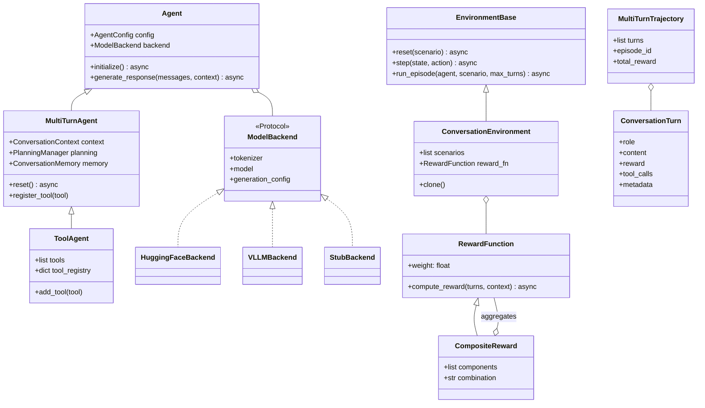

# StateSet Agents: A Reinforcement Learning Framework for Multi-Turn Conversational AI

**Technical Whitepaper**
Version 0.12.2 · May 2026
StateSet Team · `team@stateset.ai`

---

## Abstract

StateSet Agents is a reinforcement learning framework for training and serving large language model (LLM) agents that improve through **multi-turn interaction**. Unlike RLHF pipelines that optimize policies one response at a time, StateSet Agents treats the full conversational trajectory as the unit of optimization. The framework implements a family of **group-based policy optimization** algorithms — GRPO, GSPO, GEPO, DAPO, and VAPO — that reduce gradient variance by sampling multiple trajectories per prompt and computing advantages relative to a group baseline. This whitepaper describes the framework's architecture: the algorithmic foundations of each trainer, the agent and environment abstractions, the composable reward modeling system, and the operational layer (FastAPI serving, Helm/Kubernetes deployment, distributed training). We also present a comparative analysis of the five trainer variants and discuss the engineering tradeoffs that make conversational RL practical at scale.

## Versioning and Reproducibility

This whitepaper describes **version 0.12.2** of the framework. The implementation references — file paths, line numbers, default hyperparameters, LOC counts — are all taken from commit **`a2bdde4`** on `master`.

**PyPI lag.** At the time of writing, the latest PyPI release is **0.7.1**, which predates substantial parts of the surface described here (the named trainers, the Rust core, the dashboard, the auto-research loop). The 0.7.1 release also declares `Python >=3.8` in its classifiers, while the 0.12.2 source tree requires **Python ≥3.10** (with classifiers through 3.13) — when reading public PyPI metadata against this whitepaper, expect this gap. The full 0.12.2 surface can be obtained by installing from source (`pip install -e .` against the repository); a PyPI publication of 0.12.x is pending.

**What's named here is anchored in code.** Implementation citations (`gspo_trainer.py:390-419`, etc.) reference the named commit. To verify any specific claim:

```bash
git clone https://github.com/stateset/stateset-agents
cd stateset-agents
git checkout a2bdde4          # the commit this whitepaper describes
grep -n "compute_sequence_importance_ratio" stateset_agents/training/gspo_trainer.py
```

**Errata.** Corrections published after this revision are tracked in [`docs/WHITEPAPER_ERRATA.md`](./WHITEPAPER_ERRATA.md). If `git log` shows commits more recent than `a2bdde4`, check the errata file before citing this document.

A complete reproducibility command list is in **Appendix C**.

**Notably absent from this revision:** end-to-end experimental results — reward curves, head-to-head trainer comparisons, vLLM speedup measurements on specific hardware. The benchmark *methodology* is described in §7.5 and the runnable suite is in `benchmarks/`; running it on your target hardware and configuration is the recommended path. A v1.0 follow-up to this whitepaper will include canonical numbers from a fixed environment, hardware, and seed configuration.

## How to Read This Document

This whitepaper is intentionally long (≈10k words). Different audiences should navigate it differently:

- **Researchers** evaluating the algorithm coverage → §5 (Algorithmic Foundations) and §6.6 (Offline RL). The notation table in §5.0 and the comparative summary in §5.6 are the densest payoff.
- **ML engineers** starting a training run → §11 (Practitioner's Guide), particularly the trainer-selection decision tree (§11.3) and the operational recipes table (§11.4). Then Appendix B for the hyperparameter defaults that ship with each trainer.
- **Platform engineers** considering deployment → §7 (Operational Layer) for endpoints, observability, dashboard, and Helm/K8s, plus §2 (System Architecture) for the layered design.
- **Framework maintainers** or contributors → §3 (Agent Abstractions), §4 (Reward Modeling), and §9 (Testing Philosophy) — the engineering invariants that keep the codebase coherent.
- **Anyone curious about the *design philosophy*** → §10 (Discussion) and §14 (Conclusion).

The appendices (file map, hyperparameter reference) are designed as standalone references — flip to them directly when you need a fact, not a narrative.

---

## 1. Introduction

### 1.1 The Multi-Turn Problem

Conventional Reinforcement Learning from Human Feedback (RLHF) — popularized by PPO-based training of InstructGPT-class models — treats each prompt-completion pair as an independent episode. This works well for short, single-turn tasks, but it breaks down in two important regimes:

1. **Long chain-of-thought reasoning** (e.g., AIME-style math), where token-level importance ratios accumulate variance over thousands of tokens.
2. **Multi-turn dialogue and tool use**, where the policy's effect on episode reward is mediated by environment dynamics (user responses, tool outputs) and credit must be assigned across turns.

Recent research — notably GSPO (Qwen, 2025), DAPO (ByteDance, 2025), and VAPO (ByteDance, 2025) — has shown that **group-relative** updates dramatically improve stability. The core idea is to sample $G$ trajectories per prompt, normalize rewards within each group (zero mean, unit variance), and use those normalized advantages as the policy gradient signal. This eliminates the need for a separate value network (in most variants) and reduces the variance that destabilizes token-level PPO on long sequences.

### 1.2 What StateSet Agents Provides

StateSet Agents packages this research into a coherent, deployable framework:

- **Agent abstractions** (`Agent`, `MultiTurnAgent`, `ToolAgent`) with pluggable Hugging Face / vLLM / stub backends.
- **Environments** (`ConversationEnvironment`, `TaskEnvironment`) that model multi-turn episodes with explicit `reset`/`step` semantics.
- **Trajectories** as first-class data structures carrying turn-level metadata, rewards, and tool calls.
- **Composable rewards** (`RewardFunction`, `CompositeReward`) supporting heuristic, domain, multi-objective, and neural scorers.
- **Group-based trainers**: GRPO, GSPO, GEPO, DAPO, VAPO — plus PPO and RLAIF baselines.
- **Offline RL** (BCQ, BEAR, CQL, IQL, Decision Transformer) for learning from logged conversations.
- **Sim-to-real transfer**, **continual learning**, **long-term planning** modules.
- **Operational layer**: FastAPI service, OpenAI-compatible endpoints, Prometheus metrics, Helm charts, Kubernetes manifests.

The framework is licensed under **BUSL-1.1** (transitioning to Apache 2.0 on 2029-09-03), distributed on PyPI as `stateset-agents`, and supports Python 3.10–3.13 on Linux and Windows.

---

## 2. System Architecture

### 2.1 Layered Design

```
┌──────────────────────────────────────────────────────────────────┐
│  FastAPI Service Layer                                           │
│  /v1/messages · /v1/chat/completions · /training · /metrics      │
└────────────────┬─────────────────────────────────────────────────┘
                 │
   ┌─────────────┼──────────────┬──────────────────┐
   │             │              │                  │
┌──▼──────┐  ┌───▼──────┐  ┌────▼─────────┐  ┌─────▼────────┐
│ Agent   │  │ Training │  │ Inference    │  │ Memory       │
│ Service │  │ Service  │  │ Service      │  │ (Redis/SQL)  │
└──┬──────┘  └───┬──────┘  └────┬─────────┘  └──────────────┘
   │             │              │
   │       ┌─────▼──────┐       │
   │       │ BaseTrainer│       │
   │       │ GRPO·GSPO  │       │
   │       │ GEPO·DAPO  │       │
   │       │ VAPO       │       │
   │       └─────┬──────┘       │
   │             │              │
┌──▼──────┐ ┌────▼──────┐ ┌─────▼────────┐
│ Agent   │ │ Environ-  │ │ ModelBackend │
│ (Multi  │ │ ment      │ │ (HF·vLLM·    │
│  Turn / │ │ + Reward  │ │  Stub)       │
│  Tool)  │ │ Function  │ │              │
└─────────┘ └───────────┘ └──────────────┘
```

Each layer communicates through stable, typed interfaces. The serving and training layers can be deployed independently; the core abstractions (agents, environments, rewards) are usable as a Python library without any FastAPI or Kubernetes dependency.

### 2.2 Dependency Strategy

The package has a deliberately **lean core**: `numpy`, `pydantic`, `rich`, `typer`, `tqdm`, `cachetools`. Everything else — `torch`, `transformers`, `peft`, `trl`, `fastapi`, `vllm`, `optuna`, `deepspeed` — is an **optional extra**. This means:

- A user writing a custom reward function or environment never pays for a 2 GB torch install.
- CI smoke tests run on a minimal install; ML-heavy tests opt into `[training]`.
- The stub backend (described in §3.3) makes the entire agent/environment stack runnable without any model weights.

Extras are: `[training]`, `[api]`, `[trl]`, `[vllm]`, `[hpo]`, `[distributed]`, `[examples]`, `[auto-research]`.

---

## 3. Agent and Environment Abstractions

The class relationships in this section are dense — here is a single map of how the pieces connect before we describe each:



The trainer (§5) sits above this diagram: it drives the environment, samples the agent, scores the resulting trajectories via the reward function, and updates the model wrapped inside the backend.

### 3.1 The Agent Hierarchy

The framework defines a three-tier agent hierarchy in `stateset_agents/core/`:

| Class | File | Role |
|------|------|------|
| `Agent` | `core/agent.py` | Base class. Owns a `ModelBackend`, handles lazy initialization, exposes `generate_response`. |
| `MultiTurnAgent` | `core/multiturn_agent.py` | Adds `ConversationContext`, optional `DialogueDatabase`, planning manager, and async `reset()`. |
| `ToolAgent` | `core/tool_agent.py` | Adds OpenAI-compatible function calling, `tool_registry`, JSON schema validation, parallel tool execution. |

All response generation follows a single async signature:

```python
async def generate_response(
    messages: str | list[dict[str, str]],
    context: dict[str, Any] | None = None,
) -> str
```

This uniformity allows the same training loop to drive plain chat agents, tool-using agents, and planning agents without branching.

### 3.2 Configuration: `AgentConfig`

`AgentConfig` (defined in `core/agent_config.py`) is a 22-field dataclass covering model selection, generation hyperparameters, PEFT/LoRA settings, reasoning tags (DeepSeek-R1-style), and planning configuration. Validation logic enforces bounds and emits remediation suggestions for misconfigurations.

Two fields are critical for the framework's testability:

- `use_stub_model: bool = False`
- `stub_responses: list[str] | None = None`

Setting `use_stub_model=True` skips all Hugging Face loading and substitutes a deterministic in-memory backend. This is what enables the 2,438-test suite to run in seconds without GPU hardware.

### 3.3 Backends: The `ModelBackend` Protocol

`ModelBackend` is a runtime-checkable `Protocol` (PEP 544) declaring three properties — `tokenizer`, `model`, `generation_config` — each backed by its own protocol. The framework ships three concrete backends:

1. **Hugging Face backend** — loads `AutoModelForCausalLM` + `AutoTokenizer` with configurable dtype, attention implementation (`flash_attention_2`, `sdpa`, `eager`), and device map. Supports 4-bit/8-bit quantization via `bitsandbytes` and LoRA adapters via `peft`.
2. **vLLM backend** — uses `vllm.LLM` for batched, paged-attention generation [14]. Typically delivers a large speedup over plain HF `model.generate` during rollout collection; magnitude depends heavily on model, batch size, and sequence length (see §6.4 for measurement guidance). Surfaces token log-probs directly from the vLLM sampler so the trainer can skip a redundant forward pass.
3. **Stub backend** — `StubModel` + `StubTokenizer` + `StubGenerationConfig`. Returns canned or templated responses; tokenizes with a fixed 256-character vocabulary. No external downloads, no GPU.

Backend selection happens in `Agent.initialize()`: an injected backend wins, otherwise `use_stub_model=True` selects the stub, otherwise the framework loads from Hugging Face. This **dependency injection** pattern (over global patching) is what keeps the test suite reliable as the codebase grows.

### 3.4 Environments

`EnvironmentBase` (in `core/environment_base.py`) defines the canonical RL interface:

```python
async def reset(scenario: dict | None) -> EnvironmentState
async def step(state: EnvironmentState, action: ConversationTurn)
    -> tuple[EnvironmentState, float, bool, dict]
async def run_episode(agent_fn, scenario, max_turns)
```

`EnvironmentState` tracks `episode_id`, `turn_count`, an `EpisodeStatus` enum (ONGOING / COMPLETED / FAILED / TIMEOUT), and a `context` dict.

`ConversationEnvironment` extends the base with scenario-driven dialogue: each reset selects a scenario (target user persona, conversation goal, evaluation criteria), and each `step` advances the conversation by one agent turn, generates a user response, computes the step reward, and decides whether to terminate. A `clone()` factory supports parallel environment workers.

### 3.5 Trajectories and Turns

The atomic unit of data is `ConversationTurn`, supporting both a legacy `(user_message, assistant_response, reward)` tuple and a modern `(role, content, reward, tool_calls, tool_results)` form. Turns aggregate into `MultiTurnTrajectory` objects that carry episode metadata, total reward, and the full ordered turn list. Trainers consume trajectories; rewards return `RewardResult` objects that decompose into a scalar `score` plus a `breakdown` dict.

### 3.6 The Memory Subsystem

Long conversations exceed the context windows of even modern models. `core/memory.py` provides a multi-tier memory system that lets agents reference earlier context selectively, without naively passing every prior turn into every generation call.

`MemoryConfig` declares the tiers:

- **`SHORT_TERM`** — recent turns within a sliding window (bounded by `max_short_term_turns` and `max_short_term_tokens`). Always included verbatim in the next prompt.
- **`LONG_TERM`** — persistent facts and summaries surviving across episodes. Retrieved by relevance.
- **`EPISODIC`** — per-episode summaries; the unit of consolidation when a conversation closes.
- **`SEMANTIC`** — extracted entities and facts (names, dates, IDs, preferences) for structured lookup.
- **`WORKING`** — current-task context: open subgoals, intermediate results, pending tool calls.

A `ConversationMemory` instance owns these tiers and decides — on each `add_turn` — what to keep verbatim, what to summarize, and what to discard. Triggers are configurable: `summary_threshold` for when to compact a window into a summary, `importance_decay` for how aggressively to demote old content. The retrieval path supports both dense (all in-window content) and sparse (summary + top-k retrieved long-term items) prompt construction.

The persistence backend is pluggable: in-memory (default, ephemeral), Redis (for distributed agent fleets), or SQLite (for single-host durability). Long-term memory survives process restarts under Redis/SQLite, which is what enables continuity across sessions for production deployments.

---

## 4. Reward Modeling

### 4.1 The Reward Function Hierarchy

All rewards inherit from `RewardFunction` and implement:

```python
async def compute_reward(
    turns: list[ConversationTurn],
    context: dict[str, Any] | None = None,
) -> RewardResult
```

`RewardResult` is the canonical return type:

```python
@dataclass
class RewardResult:
    score: float
    breakdown: dict[str, float]
    metadata: dict[str, Any]
    explanation: str | None
```

The `total_reward` property aliases `score` for backwards compatibility with older trainer code. Both forms serialize losslessly via `to_dict()` / `from_dict()`.

### 4.2 Composition

`CompositeReward` combines multiple reward functions via four aggregation methods — `weighted_sum` (default), `average`, `min`, `max` — with graceful degradation: if any component raises, the composite continues with the remaining components and logs the failure rather than aborting training.

The framework ships a battery of concrete reward functions in `core/basic_rewards.py` and `core/domain_rewards.py`:

| Reward | Signal |
|--------|--------|
| `HelpfulnessReward` | LLM-judge helpfulness rating |
| `SafetyReward` | Toxicity, harmful-content filter |
| `CorrectnessReward` | Verifier match against ground truth |
| `ConcisenessReward` | Length penalty, redundancy detection |
| `EngagementReward` | Heuristic engagement score |
| `TaskCompletionReward` | Goal-state predicate satisfaction |
| `CustomerServiceReward` | Domain composite (resolution + tone + accuracy) |
| `TechnicalSupportReward` | Domain composite (correctness + step-by-step structure) |
| `SalesAssistantReward` | Domain composite (qualification + conversion intent) |

### 4.3 Multi-Objective Rewards

`MultiObjectiveReward` (in `rewards/multi_objective_reward.py`) supports per-turn and per-trajectory components evaluated in parallel via `asyncio.gather`. This is the standard pattern for production deployments where the scalar reward is a weighted sum of correctness, safety, brand voice, and latency penalties.

### 4.4 Neural Reward Models

Hand-crafted rewards have a ceiling: they capture exactly what their designer encoded. When you have labeled examples — pairwise preferences, scored conversations, RLHF demonstrations — you can do better by *learning* the reward function. `training/neural_reward_trainer.py` (687 LOC) provides this pathway.

The `NeuralRewardModel` (lines 137-176) is a deliberately small MLP:

- **Input.** Concatenated prompt + response embeddings (128-dimensional by default, derived from a hash-based encoder so the trainer works without a sentence-transformer dependency at training start; production setups swap in a real encoder).
- **Body.** A configurable stack of hidden layers (default 2 layers, hidden_dim=256) with ReLU/GELU activations and dropout=0.1.
- **Output.** A single scalar (the reward).
- **Initialization.** Xavier uniform for stable early training.

The trainer fits this network to a labeling source — typically the output of an existing `CompositeReward` running offline, or scored data from a stronger LLM-judge — and produces a fast, differentiable, GPU-resident reward function that doesn't require network calls during rollout scoring. This is the "Bitter Lesson" applied to rewards: stop encoding domain knowledge by hand once you have enough data to learn it.

Use cases: speeding up training when an LLM-judge reward is the bottleneck (a hosted gpt-4o-class judge can dominate step time at >$50/run); enabling differentiable reward shaping in algorithms that want gradient flow through the reward signal.

### 4.5 RLAIF and Constitutional Critique

`training/rlaif_trainer.py` (749 LOC) implements RLAIF [10] augmented with a Constitutional AI critique-revision loop [9]. The `ConstitutionalAI` class (lines 170-198) implements the three-step inner loop on every training sample:

1. **Generate** an initial response from the current policy.
2. **Critique** the response against a domain-specific set of principles. The framework ships four principle sets — `general`, `assistant`, `coding`, `reasoning` — in `CONSTITUTIONAL_PRINCIPLES` (lines 146-167); custom principle sets can be plugged in via config.
3. **Revise** the response in light of the critique.

The revised response is then scored by a judge model. `RLAIFConfig` selects the judge: `judge_provider` ∈ `{openai, anthropic, local}`, `judge_model` defaults to `gpt-4o`. Scoring criteria are `helpfulness`, `correctness`, `harmlessness`.

The resulting scalar reward feeds into a downstream policy optimizer — RLAIF can be configured to use PPO, GRPO, or GSPO under the hood (`config.algorithm`, line 118), with sensible defaults: `beta=0.1` (KL penalty enabled — critical when the judge is more powerful than the learner), `clip_eps=0.2`, `num_generations=4`, optional self-play every 100 steps.

This is the canonical path for training agents without human-labeled preference data: bootstrap from a stronger model's judgment, regularize against drift via KL to a reference, and iterate.

---

## 5. Algorithmic Foundations

This section describes the five group-based policy optimization algorithms that form the core of the training stack. All inherit from `BaseTrainer` (in `training/base_trainer.py`), which provides shared optimizer setup (AdamW with cosine warmup), reference-model KL computation, gradient clipping with statistics tracking, mixed-precision support, and W&B integration.

### 5.0 Notation

| Symbol | Meaning |
|--------|---------|
| $x$ | Prompt (the conditioning context) |
| $y_i = (y_{i,1}, \dots, y_{i,L_i})$ | The $i$-th sampled response in a group |
| $G$ | Group size: number of responses sampled per prompt |
| $L_i = \|y_i\|$ | Token length of response $i$ |
| $\pi_\theta$ | Current (learner) policy with parameters $\theta$ |
| $\pi_{\theta_{\text{old}}}$ | Behavior (sampler) policy — the policy used to draw rollouts |
| $\pi_{\text{ref}}$ | Frozen reference policy, typically the SFT initialization |
| $r_i$ | Scalar reward for trajectory $i$, returned by the reward function |
| $A_i$ | Group-relative advantage: $(r_i - \mu)/\sigma$ where $\mu, \sigma$ are the group's mean and std |
| $\rho_t$ | Token-level importance ratio $\pi_\theta(y_t \mid \cdot)/\pi_{\theta_{\text{old}}}(y_t \mid \cdot)$ |
| $s_i$ | Sequence-level importance ratio (GSPO): $\left(\prod_t \rho_{i,t}\right)^{1/L_i}$ |
| $\varepsilon$, $\varepsilon_L$, $\varepsilon_H$ | PPO clip parameters; $\varepsilon_L \neq \varepsilon_H$ under Clip-Higher |
| $\beta$ | KL penalty coefficient (often 0 in group-based methods) |
| $V_\phi(s_t)$ | Value function (only in VAPO) |
| $\lambda$ | GAE decay parameter (only in VAPO) |

All trainers operate over **response tokens only**: prompt tokens are masked out of every sum, log-prob, and loss term.

### 5.1 GRPO (Group Relative Policy Optimization)

**Source.** The original group-based RL formulation, popularized by DeepSeek-Math [5]. StateSet Agents wraps the Hugging Face TRL implementation via `TRLGRPOTrainerWrapper`.

**Objective.** For each prompt $x$, sample $G$ responses $\{y_i\}_{i=1}^G$. Compute group-normalized advantages $A_i = (r_i - \mu) / \sigma$, then optimize the standard clipped surrogate at the token level:

$$
\mathcal{L}_{\text{GRPO}} = -\mathbb{E}\left[\min\left(\rho_t A_i,\ \text{clip}(\rho_t, 1-\varepsilon, 1+\varepsilon) A_i\right)\right]
$$

where $\rho_t = \pi_\theta(y_t \mid x, y_{<t}) / \pi_{\theta_{\text{old}}}(y_t \mid \cdot)$.

**Defaults.** `num_generations=4`, `beta=0.0` (KL disabled), `max_grad_norm=1.0`, `gradient_checkpointing=True`.

**When to use.** General-purpose baseline. Best when the reward verifier is reliable and trajectories are short-to-medium length.

### 5.2 GSPO (Group Sequence Policy Optimization)

**Source.** Zheng et al. [1], Qwen team. StateSet Agents implements this in-house: `GSPOTrainer` (`training/gspo_trainer.py`, 852 LOC).

**Key innovation.** Replace the token-level importance ratio with a **length-normalized sequence-level** one:

$$
s_i(\theta) = \left(\frac{\pi_\theta(y_i \mid x)}{\pi_{\theta_{\text{old}}}(y_i \mid x)}\right)^{1/|y_i|} = \exp\left(\frac{1}{|y_i|}\sum_t \log\frac{\pi_\theta(y_{i,t} \mid \cdot)}{\pi_{\theta_{\text{old}}}(y_{i,t} \mid \cdot)}\right)
$$

The objective then applies standard symmetric PPO clipping over the sequence-level ratio:

$$
\mathcal{L}_{\text{GSPO}} = -\mathbb{E}\left[\min\left(s_i(\theta) A_i,\ \text{clip}(s_i(\theta), 1-\varepsilon_L, 1+\varepsilon_R) A_i\right)\right]
$$

The framework allows $\varepsilon_L \neq \varepsilon_R$ in the config, but the shipped defaults are symmetric — Clip-Higher asymmetry is reserved for DAPO and VAPO (§5.4–5.5). The critical thing about the GSPO clip bounds is not their symmetry but their *magnitude*: because $s_i$ is already exp-of-a-small-per-token-quantity, the bounds must be much tighter than token-level PPO's `0.2`. See the defaults note below.

**Why it matters.** Token-level ratios accumulate variance multiplicatively across the sequence; on long outputs and Mixture-of-Experts models, this manifests as training collapse. Length normalization keeps the importance weight in a stable regime regardless of $|y_i|$.

**Pseudocode** (paraphrased from `gspo_trainer.py:390-680`):

```python
# Phase 1: rollout collection
for prompt in batch:
    responses = generate(policy_old, prompt, n=group_size)
    rewards = await reward_fn(responses)
    advantages = (rewards - rewards.mean()) / (rewards.std() + 1e-8)

# Phase 2: GSPO update
for response, A in zip(responses, advantages):
    L = response_length(response)
    logp_new = sum_logprob(policy_new, response)   # gradient-tracked
    logp_old = sum_logprob(policy_old, response)   # detached
    s = torch.exp((logp_new - logp_old) / L)       # sequence-level ratio
    obj = torch.min(s * A, s.clamp(1-eps_L, 1+eps_R) * A)
    loss = -obj.mean()
    if beta > 0 and ref_model is not None:
        loss = loss + beta * forward_kl(policy_new, ref_model, response) / L
    loss.backward(); optimizer.step()
```

**Implementation citations.** Sequence ratio computed at `gspo_trainer.py:390-419` (log-sum, length-normalize, exponentiate as separate steps to retain numerical stability). Clipped surrogate at `gspo_trainer.py:639-649`. Per-sequence KL penalty (only when `beta > 0`) at lines 652-660. Right-padding is enforced for stable prompt-boundary detection across the batch.

**Defaults.** `num_generations=4`, `clip_range_left=3e-4`, `clip_range_right=4e-4`, `warmup_ratio=0.1`. These clip bounds are taken from the original GSPO paper and are roughly three orders of magnitude tighter than token-level PPO — necessary because the length-normalized ratio lives close to 1.0. **If you see no exploration, this is the first knob to widen.** Single gradient step per rollout (no inner PPO epochs) — a deliberate choice for stability with on-policy data.

**When to use.** Long outputs (CoT, code, structured generation), MoE models, any case where token-level GRPO is unstable.

### 5.3 GEPO (Group Expectation Policy Optimization)

**Source.** Reference [4]. Implementation in `training/gepo_trainer.py` (724 LOC).

**Key innovation.** Replace per-trajectory importance weights with a **group-level expectation**. Let $p(y \mid x)$ denote the learner-policy sequence probability and $q_i = q(y_i \mid x)$ the sampler-policy probability for the $i$-th group member. Define:

$$
w_{\text{GEIW}}(y \mid x) \;=\; \frac{p(y \mid x)}{E_q[q]}, \qquad E_q[q] \;\approx\; \sum_{i=1}^{G} \tilde{q}_i \cdot q_i, \qquad \tilde{q}_i \;=\; \frac{q_i}{\sum_{j=1}^{G} q_j}
$$

The denominator $E_q[q]$ is computed once per group as a scalar; every member of the group is divided by the *same* value, which is what amortizes importance-weight variance across the group. Standard PPO clipping is then applied over $w_{\text{GEIW}}$.

**Why it matters.** Group-level aggregation amortizes importance-weight variance across the group, which is especially valuable when sampler and learner policies diverge (e.g., heterogeneous compute, network-delayed actors, off-policy data). The denominator is scalar, avoiding per-sequence division instabilities.

**Implementation citations.** `GEPOTrainer` in `gepo_trainer.py` (724 LOC). The group-expectation denominator is computed at `gepo_trainer.py:301-337` (`compute_gepo_coefficient`); the sampler-side probabilities are explicitly **detached** at line 326 so the denominator does not flow gradient. The computation is per-sequence (1-D tensors of shape `[group_size]`), so every member of a group divides by the *same* scalar expectation — this is what amortizes variance across the group. Clipped surrogate at lines 517-534.

**Defaults.** `group_size=8`, `clip_eps=0.2`, `beta=0.0` (KL typically disabled — group weights handle divergence implicitly), `use_group_baseline=True`.

**When to use.** Distributed or asynchronous training, off-policy batches, replay-based RL.

### 5.4 DAPO (Decoupled Clip and Dynamic Sampling Policy Optimization)

**Source.** Yu et al. [2], ByteDance. Implementation in `training/dapo_trainer.py` (945 LOC). The paper reports 50/60 on AIME 2024 with Qwen-2.5-32B; we have not independently reproduced this number.

**Four innovations.**

1. **Clip-Higher (asymmetric clipping).** $\text{clip}(\rho_t) \in [1 - \varepsilon_L, 1 + \varepsilon_R]$ with $\varepsilon_L = 0.2,\ \varepsilon_R = 0.28$. Allowing more upside than downside encourages exploration without sacrificing stability.

2. **Token-level loss normalization.** Divide the surrogate sum by **total response tokens** across the batch, not by sample count. This prevents the implicit bias toward shorter sequences that arises when each sample contributes equally regardless of length:

   $$
   \mathcal{L}_{\text{DAPO}} = -\frac{1}{\sum_i |y_i|}\sum_{i,t} \min\left(\rho_{i,t} A_i,\ \text{clip}(\rho_{i,t}) A_i\right)
   $$

3. **Dynamic sampling.** A `DynamicSamplingBuffer` filters out prompts where all $G$ rollouts are correct or all are incorrect — these provide zero gradient signal. The buffer keeps sampling until every retained prompt has $0 < \text{accuracy} < 1$.

4. **Overlong reward shaping.** A graduated length penalty: no penalty if $|y| \leq L_\text{max} - L_\text{cache}$; linear interpolation from 0 to $-1$ within the cache region; full $-1$ penalty if $|y| > L_\text{max}$. Defaults: `max_generation_length=20480`, `overlong_cache_length=4096`.

**Implementation citations.** `DAPOTrainer` in `dapo_trainer.py` (945 LOC). `DynamicSamplingBuffer.should_include` at lines 276-278 (strict `min_accuracy < acc < max_accuracy`; both 0.0 and 1.0 are excluded). `DAPORewardShaper.compute_length_reward` at lines 226-244 — three-region piecewise penalty with `soft_start = max_length − cache_length = 16384` by default. Asymmetric clip and token-level loss normalization at lines 542-567. Optional inner gradient updates loop at line 850 with `old_token_log_probs.detach()` at line 858.

**Pseudocode** (paraphrased):

```python
# Phase 1: dynamic sampling — keep rolling until every prompt has 0<acc<1
buffer = DynamicSamplingBuffer(min_accuracy=0.0, max_accuracy=1.0)
while not buffer.full(batch_size):
    prompt = sample_prompt()
    responses = generate(policy_old, prompt, n=group_size)
    rewards = await reward_fn(responses)
    accuracy = (rewards > threshold).float().mean()
    if 0.0 < accuracy < 1.0:
        # Apply overlong shaping per response
        for r, response in zip(rewards, responses):
            L = len(response)
            if L > max_length:
                r += -1.0                          # full penalty
            elif L > soft_start:
                r += -(L - soft_start) / cache_length  # linear penalty
        buffer.add(prompt, responses, rewards)

# Phase 2: DAPO update — token-level, Clip-Higher
total_tokens = sum(response_lengths(buffer))
for response, A in buffer:
    for t in response_tokens(response):
        r_t = exp(logp_new[t] - logp_old[t])
        obj_t = min(r_t * A, r_t.clamp(1-eps_L, 1+eps_H) * A)
        loss = -sum(obj_t) / total_tokens          # divide by tokens, not samples
    loss.backward(); optimizer.step()
```

**Defaults.** `group_size=16`, `clip_eps_low=0.2`, `clip_eps_high=0.28`, `max_generation_length=20480`, `overlong_cache_length=4096`, `learning_rate=1e-6`, constant learning-rate schedule (per paper). The group size is deliberately larger than GRPO/GSPO/GEPO because dynamic sampling needs candidates to find non-degenerate groups. Optional vLLM acceleration that reuses sampler log-probs.

**When to use.** Long chain-of-thought reasoning, math/code tasks, scenarios where reward sparsity is the bottleneck.

### 5.5 VAPO (Value-Augmented Policy Optimization)

**Source.** Yue et al. [3], ByteDance. Implementation in `training/vapo_trainer.py` (1036 LOC). The paper reports 60.4 on AIME 2024; we have not independently reproduced this number.

**Key innovation.** Reintroduce a **value network**, but train it asymmetrically against the policy.

The total loss is a three-term composite:

$$
\mathcal{L}_{\text{total}} = \mathcal{L}_{\text{policy}} + c_v \cdot \mathcal{L}_{\text{value}} + w_{\text{lm}} \cdot \mathcal{L}_{\text{positive-LM}}
$$

with four supporting mechanisms:

1. **Value-network warmup.** Train the value head alone for 50 steps using Monte Carlo returns before joint training. Mitigates the initialization bias that destabilizes early policy updates.

2. **Decoupled GAE.** The critic uses $\lambda = 1.0$ (unbiased MC); the policy uses a **length-adaptive** $\lambda$, computed per-sequence as:

   $$
   \lambda_{\text{policy}} = 1 - \frac{1}{\alpha \cdot |y| + 1}, \quad \alpha = 0.05
   $$

   For a 100-token response this gives $\lambda \approx 0.83$; for a 1000-token response, $\lambda \approx 0.98$. This balances bias and variance differently for short vs. long trajectories.

3. **Positive-example LM loss.** On samples flagged correct by the verifier, add a standard next-token NLL term. This stabilizes the policy when reward signal is sparse: the model is still moving toward the distribution of correct outputs.

4. **Clip-Higher.** Same asymmetric clipping as DAPO (`eps_low=0.2`, `eps_high=0.28`).

**Implementation citations.** `ValueHead` (2-layer GELU MLP, scalar output) at `vapo_trainer.py:177-223`. `LengthAdaptiveGAE` at lines 225-349; the exact length-adaptive λ is computed at line 256 as `1 − 1/(α·L + 1)`, evaluated per-sequence (not vectorized across the batch) so that each sequence gets its own λ. `warmup_value_network` at lines 575-680 — trains *only* the value head against MC returns; the policy is frozen for the warmup window. Optional value clipping (PPO-style `V_clipped = V_old + clamp(V − V_old, ±clip)`) at lines 729-738.

**Defaults.** `group_size=16`, `value_warmup_steps=50`, `lambda_critic=1.0`, `lambda_policy_alpha=0.05`, `value_loss_coef=0.5`, `positive_lm_weight=0.1`, `actor_learning_rate=1e-6`, `critic_learning_rate=2e-6`. Separate optimizers and schedulers for actor and critic.

**When to use.** Highest-quality reasoning training when compute permits. Trades off ~2× memory (value network) and slower convergence (warmup) for SOTA final accuracy.

### 5.6 Comparative Summary

| Property | GRPO | GSPO | GEPO | DAPO | VAPO |
|----------|------|------|------|------|------|
| Importance weight | Token | **Sequence (length-norm.)** | **Group expectation** | Token | Token + value |
| Clipping | Symmetric | Symmetric | Symmetric | **Asymmetric (Clip-Higher)** | **Asymmetric** |
| Loss normalization | Sample | Sequence | Group | **Token** | **Token** |
| Advantage baseline | Group | Group | Group | Group | **Decoupled GAE** |
| Value network | No | No | No | No | **Yes (warmup + decoupled λ)** |
| Defining mechanism | Library baseline | Length normalization | Group expectation | Dynamic sampling + overlong shaping | Length-adaptive GAE + positive LM |
| Reported AIME score | — | — | — | 50/60 | **60.4** |
| Memory cost | Medium | Medium | Medium | Medium | **High** |
| Best for | General | Long outputs, MoE | Async/off-policy | Reasoning | SOTA reasoning |

### 5.7 A Note on KL Divergence

The framework's KL implementation (`base_trainer.py:600-631`, `compute_kl_divergence`) departs from a common shortcut. Most open implementations use either PyTorch's `F.kl_div` (which computes the *reverse* direction $\mathrm{KL}(\pi_{\text{ref}} \| \pi_\theta)$ — wrong for policy gradients) or Schulman's k3 estimator $r - 1 - \log r$ (a low-variance Monte Carlo estimator). StateSet Agents computes the **exact analytical forward KL** directly:

$$
\mathrm{KL}(\pi_\theta \| \pi_{\text{ref}}) = \sum_v \pi_\theta(v) \cdot \bigl(\log \pi_\theta(v) - \log \pi_{\text{ref}}(v)\bigr)
$$

evaluated over the full vocabulary at every response position, then masked to response tokens and normalized by the response length. The cost is one extra `softmax(logits)` per step (already cached when computing log-probs); the benefit is that the KL term is **unbiased and exact**, not a single-sample estimator. For small group sizes this materially reduces variance in the regularization signal — relevant whenever `beta > 0`. The trade-off is memory: the materialized `current_probs` tensor is $|\text{batch}| \times |\text{seq}| \times |V|$, which can be ~1 GB at 32k vocab and 2k sequence length. The framework supports gradient checkpointing of this term for long-context training.

---

## 6. Training Infrastructure

### 6.1 `BaseTrainer` Abstractions

`BaseTrainer` (`training/base_trainer.py`, 853 LOC) is a generic abstract class parameterized by a config type. It owns:

- **Optimizer setup.** AdamW with configurable betas (default 0.9, 0.999) and weight decay; LoRA-aware parameter grouping when `use_peft=True`.
- **Scheduler.** Cosine warmup with configurable warmup ratio (default 0.1); VAPO splits this into separate actor and critic schedulers.
- **Log-prob computation.** Per-token gradient-tracking log-probs with response masking — only response tokens contribute to the loss, prompt tokens are excluded via attention masks.
- **KL divergence.** Forward KL $\pi_\theta \cdot \log(\pi_\theta / \pi_{\text{ref}})$ against an optional frozen reference model.
- **Gradient clipping.** Norm-based clipping (default `max_grad_norm=1.0`) with statistics tracking — `grad_norm`, `grad_max`, `grad_mean`, `num_zero_grads` — for monitoring vanishing/exploding gradients.

### 6.2 Model Management

`BaseModelManager` provides unified model loading across all trainers:

- **LoRA / QLoRA** via `peft` (configurable `r`, `lora_alpha`, `lora_dropout`).
- **Quantization** via `bitsandbytes` (4-bit NF4 default, 8-bit option).
- **Mixed precision** (`bfloat16` recommended on H100/A100; `float16` fallback).
- **Gradient checkpointing** for memory-bound training.
- **Reference model** management for KL-regularized objectives.

### 6.3 Distributed Training

The framework integrates with **Hugging Face Accelerate** for single-node multi-GPU training and **DeepSpeed** (optional `[distributed]` extra) for multi-node training with ZeRO stages 1–3. Ray Train integration is available via the `[hpo]` extra for hyperparameter sweeps.

### 6.4 vLLM Integration

For trainers that support it (TRL GRPO, DAPO), the rollout phase can be offloaded to vLLM [14]. The trainer's policy weights are synced to a vLLM engine at the start of each rollout round; vLLM generates the batch with paged attention; sampler log-probs are passed back to the trainer to avoid a redundant forward pass.

The speedup is real but variable. The benchmark suite under `benchmarks/performance_benchmarks.py` measures it for a given (model, hardware, batch, sequence-length) combination — we publish the methodology rather than a single multiplier because reported numbers from comparable frameworks span roughly 3× to 20× depending on configuration. Practitioners should measure on their own workload before assuming a specific factor. The dominant variable is batch size: vLLM's edge over HF `generate` widens substantially as `group_size × prompt_batch_size` grows.

### 6.5 The Training Data Flow

Every group-based trainer follows the same five-phase loop. The phases are explicit in the codebase and worth understanding because they determine where parallelism is exploited and where serialization is unavoidable:

```
┌──────────────┐    ┌──────────────┐    ┌──────────────┐    ┌──────────────┐    ┌──────────────┐
│ 1. Sample    │───▶│ 2. Generate  │───▶│ 3. Score     │───▶│ 4. Advantage │───▶│ 5. Update    │
│  prompts     │    │  G responses │    │  rewards     │    │  computation │    │  policy      │
│              │    │  per prompt  │    │  (async)     │    │  (group-norm)│    │  (loss + bwd)│
└──────────────┘    └──────┬───────┘    └──────┬───────┘    └──────────────┘    └──────────────┘
                           │                   │
                    ┌──────▼──────┐     ┌──────▼──────┐
                    │ HF | vLLM   │     │ Composite   │
                    │ | Stub      │     │ Reward      │
                    │ backend     │     │ (parallel)  │
                    └─────────────┘     └─────────────┘
```

- **Phase 1** is cheap and CPU-bound — sampling indices from a scenario dataset.
- **Phase 2** dominates wall-clock time in most configurations. This is where vLLM matters most (§6.4); the speedup is workload-dependent.
- **Phase 3** is bottlenecked by reward-function I/O (LLM-judge calls, external verifiers). `asyncio.gather` over the $G$ responses is the canonical pattern; for hosted LLM judges, batched async concurrency can be the dominant lever on step time.
- **Phase 4** is microseconds — a single tensor op per group.
- **Phase 5** is GPU-bound: forward pass, loss, backward, optimizer step. Memory dominates; speed is secondary.

DAPO adds a **filter step** between 3 and 4 (the `DynamicSamplingBuffer` rejects groups with degenerate accuracy). VAPO adds a **value forward pass** in step 5. GEPO replaces the standard step-4 advantage with the group-expectation coefficient.

When an agent uses the memory subsystem (§3.6), its prompt at step 2 is *constructed* from the current `EnvironmentState.context` plus retrieved long-term and semantic memory. The retrieval happens before generation and serializes into the resulting `ConversationTurn`'s `metadata` so the trainer sees exactly what the policy saw. Memory is not part of the loss — it is, from the trainer's perspective, just part of the conditioning context — but it materially affects what trajectories get sampled in step 2 and what context the reward function in step 3 has access to.

### 6.6 Offline RL Trainers

The framework's online group-based trainers assume a fresh on-policy sampling phase per step. When that's infeasible — e.g., training from logged customer-support conversations, or warm-starting from a static demonstration set — the framework provides an offline RL track via `OfflineGRPOTrainer` (`training/offline_grpo_trainer.py`).

`OfflineGRPOConfig` selects the offline value-learning algorithm via a single field, `offline_algorithm`, with five supported values:

| Algorithm | Mechanism |
|-----------|-----------|
| **CQL** (Conservative Q-Learning) | Adds a conservatism penalty that pushes down Q-values on out-of-distribution actions, preventing overestimation bias. |
| **IQL** (Implicit Q-Learning) | Avoids querying out-of-distribution actions entirely by using expectile regression on in-distribution actions. The default; safest under distribution shift. |
| **BCQ** (Batch-Constrained Q-Learning) | Restricts the policy to actions close (in a generative-model sense) to the data distribution. |
| **BEAR** (Bootstrap Error Accumulation Reduction) | Constrains the policy via MMD distance from the behavior policy. |
| **DT** (Decision Transformer) | Sequence-modeling formulation: condition on desired return, predict actions. |

The trainer supports a **blended schedule**: an initial offline-only warmup (`warmup_offline_steps=1000` by default) followed by a linear/exponential/constant transition to online GRPO updates. The offline and online value contributions are mixed via `offline_weight` and `online_weight` (both 0.5 by default), and a hybrid baseline (`baseline_type="hybrid"`) averages offline V-values with online group baselines.

State and action embeddings come from a configurable sentence-transformer (`embedding_model="all-MiniLM-L6-v2"` by default), so trajectories of arbitrary text length get fixed-dimensional representations for the value network.

**When to use.** Bootstrapping from logged conversations; environments where rollouts are expensive (real users, real money); safety-constrained training where you want a behavior-policy regularizer.

### 6.7 Continual Learning

Production agents see distribution shift: new product categories, new user demographics, new policies. Catastrophic forgetting — where fine-tuning on new tasks erases prior capabilities — is the canonical failure mode.

`stateset_agents/training/continual_learning.py` provides seven configurable strategies via a single `strategy` enum:

| Strategy | Mechanism | Memory cost |
|----------|-----------|-------------|
| `none` | Standard fine-tuning baseline | 0 |
| `replay` | Sample from a `TrajectoryReplayBuffer` of past tasks; mix into current batches | Buffer size |
| `lwf` | Learning without Forgetting: KL penalty against a frozen snapshot of the pre-task model | 1× model weights |
| `ewc` | Elastic Weight Consolidation: per-parameter Fisher-information regularizer pulling toward pre-task weights | 1× model weights + Fisher diagonal |
| `replay+lwf` | Replay + LwF | Buffer + 1× weights |
| `replay+ewc` | Replay + EWC | Buffer + 1× weights + Fisher |
| `replay+lwf+ewc` | All three | Maximum |

The `TrajectoryReplayBuffer` supports four sampling modes — uniform, recent-biased, reward-weighted, and balanced-by-task — and two storage policies (reservoir for unbounded streams, FIFO for fixed-window). Reward-weighted sampling is particularly useful when high-reward trajectories are rare: they get preferentially preserved across task boundaries.

### 6.8 The Rust Acceleration Core

A subset of the framework's hottest paths — group-advantage computation, GAE, importance-ratio math, reward normalization — are implemented in Rust and exposed to Python via **PyO3**. The crate `stateset-rl-core` lives at `rust_core/` and compiles as both `cdylib` (for Python import) and `rlib` (for downstream Rust integration).

**Functions exposed to Python:**

| Rust function | Purpose |
|--------------|---------|
| `compute_group_advantages` | Within-group reward normalization with Welford's online algorithm |
| `compute_gae` | Single-trajectory Generalized Advantage Estimation with configurable γ, λ |
| `batch_compute_gae` | Parallel GAE across a batch of trajectories, parallelized via Rayon |
| `compute_gspo_importance_ratios` | Length-normalized sequence ratios for GSPO |
| `compute_ppo_clipped_surrogate` | The standard PPO clipped objective |
| `normalize_with_running_stats` | Streaming Welford normalization for cross-batch advantage statistics |

The performance rationale is twofold. First, these operations are pure numerical kernels — no Python objects, no I/O — so they benefit directly from compiled code, SIMD, and Rayon's work-stealing parallelism without GIL contention. Second, NumPy arrays are zero-copied through `ndarray`, keeping the Python ↔ Rust boundary cost low relative to the per-call work.

The Rust core is **optional**. The framework includes pure-Python fallbacks for every accelerated function. CI builds the Rust core via `maturin` and tests both paths; users who can't compile Rust still get a working framework, just slower on advantage computation in large batches.

**Configuration in `Cargo.toml`:** release builds use `opt-level=3`, LTO=fat, codegen-units=1, panic=abort — standard Rust release settings.

### 6.9 Sim-to-Real Transfer

Most production agents are trained against *simulated* users (templated personas, scripted user models) and then deployed against real ones. The simulator-to-reality gap is real: real users are more variable, less cooperative, less articulate.

The framework provides two complementary modules:

- `domain_randomization.py` — randomizes the simulator. A `UserPersona` has seven core traits (patience, expertise, verbosity, formality, emotional stability, cooperativeness, detail orientation) plus response-level noise (typos, truncation, latency simulation). Five pre-defined templates cover canonical edge cases: `patient_expert`, `frustrated_novice`, `busy_professional`, `curious_learner`, `skeptical_critic`. Curriculum learning ramps difficulty from 0.3 → 0.9 over a configurable horizon (default 5,000 steps).
- `sim_to_real.py` — bridges sim and real. A `UserBehaviorModel` learns to predict real-user responses (embedding, length, emotion, continuation probability) from logged conversations. A `DomainAdaptationModule` then aligns sim and real distributions using one of three methods: **DANN** (adversarial domain confusion), **MMD** (maximum mean discrepancy minimization), or **CORAL** (covariance alignment). A progressive-transfer schedule decays the simulation weight from 1.0 to 0.1 over training, with early stopping based on monitored sim-real gap.

These modules are designed to compose with any trainer: the simulator is just a `ConversationEnvironment` subclass, so DAPO or VAPO can run on top of a domain-randomized user model with no algorithmic change.

---

## 7. Operational Layer

### 7.1 FastAPI Service

`stateset_agents/api/main.py` exposes the framework as an HTTP service. Key endpoints:

| Path | Purpose |
|------|---------|
| `POST /v1/messages` | Multi-turn conversation (Anthropic-compatible) |
| `POST /v1/chat/completions` | OpenAI-compatible chat |
| `POST /agents` · `GET /agents/{id}` | Agent lifecycle |
| `POST /agents/{id}/messages` | Single-turn inference |
| `POST /training` · `GET /training/{id}` | Training job submission and status |
| `GET /metrics` | Prometheus metrics |
| `GET /ready` · `/live` | Kubernetes health probes |
| `GET /circuits` | Circuit breaker status |

A `LazyApp` ASGI proxy defers application initialization to the first request, keeping cold-start latency low. The lifespan manager initializes a configurable cache backend (in-memory or Redis), an optional persistence backend (PostgreSQL or SQLite), an `AgentService`, and a `TrainingService`. Middleware stack: GZip, CORS, rate limiting, security headers.

**Example: send a message to an agent.**

```bash
curl -X POST https://api.example.com/v1/messages \
  -H "Authorization: Bearer $TOKEN" \
  -H "Content-Type: application/json" \
  -d '{
    "model": "agent-customer-support-v3",
    "messages": [
      {"role": "user", "content": "My order #12345 hasn'\''t arrived"}
    ],
    "max_tokens": 512,
    "temperature": 0.7
  }'
```

**Example: kick off a training job.**

```bash
curl -X POST https://api.example.com/training \
  -H "Authorization: Bearer $ADMIN_TOKEN" \
  -H "Content-Type: application/json" \
  -d '{
    "algorithm": "gspo",
    "base_model": "Qwen/Qwen3.5-0.8B",
    "environment": "customer_support_v2",
    "config": {"group_size": 4, "learning_rate": 5e-6, "num_epochs": 3}
  }'
# → {"training_id": "tr_a1b2c3", "status": "queued"}
```

**Example: poll a training job.**

```bash
curl https://api.example.com/training/tr_a1b2c3 \
  -H "Authorization: Bearer $ADMIN_TOKEN"
# → {"status": "running", "step": 142, "loss": 0.0341, "reward_mean": 0.62, ...}
```

The OpenAI-compatible `/v1/chat/completions` endpoint accepts the same request shape as the OpenAI API, which means clients written against OpenAI (Python SDK, LangChain, LiteLLM, OpenWebUI) work against a StateSet Agents service with only a base-URL change.

### 7.2 Deployment Artifacts

**Docker.** A multi-stage Dockerfile compiles the Rust acceleration layer from source, then ships a Debian-slim runtime under a non-root user. The bundled `docker-compose.yml` provides a full local stack: the API, the StateSet commerce backend (`stateset-api`, pinned tag), PostgreSQL 16, Redis 7.

**Kubernetes.** A Helm chart (v0.1.0) ships with 10+ values overlays for different GPU profiles (A100, H100, B200, Kimi-K2.5 fine-tuned, GLM 5.1 FP8). GKE-specific overlays cover both Autopilot and Standard cluster types, with separate staging/production examples. Raw manifests under `deployment/kubernetes/` cover training jobs (Qwen 3.5 27B, Kimi-K2.5, GLM 5.1) and vLLM serving deployments.

### 7.3 Observability

A production training and serving stack must be observable. The framework exposes two metric surfaces.

**HTTP-layer Prometheus metrics** (`stateset_agents/api/middleware.py`):

| Metric | Type | Labels |
|--------|------|--------|
| `stateset_http_requests_total` | Counter | `method`, `endpoint`, `status_code` |
| `stateset_http_request_duration_seconds` | Histogram | `method`, `endpoint` |
| `stateset_http_requests_in_progress` | Gauge | `method`, `endpoint` |

These are the standard latency/throughput/error triplet — the basis of any RED-method ([Rate, Errors, Duration](https://www.weave.works/blog/the-red-method-key-metrics-for-microservices-architecture/)) dashboard.

**Domain-specific metrics** (`stateset_agents/api/grpo/metrics.py`): a `GRPOMetrics` class tracks:

- Request counts and status counts (per endpoint)
- Latencies (a rolling `deque`, with `get_latency_percentiles()` computing avg/p50/p95/p99)
- Error counts and rate-limit hit counts
- Training-job lifecycle: `training_jobs_started`, `training_jobs_completed`, `training_jobs_failed`, `total_trajectories`, `total_computation`
- Conversation lifecycle: `conversations_started`, `conversations_ended`, `messages_processed`
- WebSocket: `websocket_connections`, `websocket_messages`

These domain metrics are exposed at:

- `GET /metrics` — Prometheus text format (scrape from Prometheus / Grafana Agent / OpenTelemetry Collector).
- `GET /metrics/json` — admin-authenticated JSON dump (useful for ad-hoc debugging).
- `GET /metrics/security` — security-event metrics (rate-limit hits, auth failures).
- `GET /metrics/cache` — cache hit/miss/size.
- `GET /health` — composite health check, cached for 5 seconds to avoid hammering downstreams.

Prometheus export is gated by the `API_ENABLE_PROMETHEUS` environment variable so the dependency is opt-in.

### 7.4 The Dashboard

A React 19 + Vite + TypeScript dashboard ships in `dashboard/` for interactive monitoring and experiment management. It is a thin client over the FastAPI service — no direct database access — and provides six views:

1. **Dashboard** — overview of recent experiments
2. **Create Experiment** — submit a new training run with a configuration form
3. **Live Monitor** — stream loss/reward curves from an active run (polls `/experiments/{id}/metrics` every 5 s; Recharts for plotting)
4. **Compare Experiments** — side-by-side metric comparison across runs
5. **Playground** — interactive chat with a trained agent for qualitative testing
6. **Leaderboard** — ranked view of recent runs by objective metric

Keyboard shortcuts (`Cmd+N`, `D`, `P`, `L`, `C`) navigate views; the dashboard is bundled with the API container or can be served independently as a static site.

### 7.5 Benchmark Methodology

The repository ships a benchmark suite under `benchmarks/` whose output is the basis for any performance claim we make. Rather than publish numbers that will go stale with the next driver, model release, or kernel update, this whitepaper publishes the *methodology* and points to the suite:

- `benchmarks/performance_benchmarks.py` (1128 LOC) — end-to-end training and inference latency, throughput, memory footprint.
- `benchmarks/algorithm_comparison.py` (569 LOC) — head-to-head GRPO vs. GSPO vs. DAPO on a fixed environment and reward.
- `benchmarks/framework_comparison.py` (526 LOC) — StateSet Agents vs. baseline TRL on matched configurations.
- `benchmarks/real_performance_benchmarks.py` (443 LOC) — vLLM vs. plain HF generation, measured at multiple batch sizes.

The shared `BenchmarkResult` dataclass captures: name, iterations, avg / min / max / p50 / p95 / p99 latency (ms), std_dev, throughput (ops/sec), memory_mb. Results land in `benchmark_results/` as JSON and (optionally) HTML reports via `--report html`. We recommend practitioners run the relevant slice on their target hardware before committing to a configuration — the headline multipliers vary too much across deployments to publish a single canonical number.

### 7.6 CI/CD

GitHub Actions (`.github/workflows/`) runs:

- **Test matrix** — Python 3.10/3.11/3.12/3.13 on Ubuntu; 3.10/3.13 on Windows.
- **Lint and type checks** — `ruff`, `black`, `isort`, `mypy` (strict mode gated per-module).
- **Tests** — `pytest` with Codecov upload. Coverage reporting reflects only paths exercised by the in-process unit and integration tests (~49% of total LOC). End-to-end serving, Helm-rendering, and GPU-only training paths are tested but don't contribute to per-line coverage; the headline number understates the tested surface. The CI gate requires the core-abstractions modules to stay above a stricter threshold via Codecov component scoping.
- **Security scans** — `bandit` and `safety` SBOM generation.
- **Helm validation** — `helm lint` and template rendering across all values overlays.
- **Docs** — Sphinx build with RTD theme.

---

## 8. Supported Models

StateSet Agents ships first-class starters (with dedicated CLI commands, configuration modules, and three preconfigured profiles each) for:

| Model | HF ID | CLI |
|-------|-------|-----|
| Qwen 3.5 0.8B | `Qwen/Qwen3.5-0.8B` | `stateset-agents qwen3-5-0-8b` |
| Gemma 4 31B IT | `google/gemma-4-31B-it` | `stateset-agents gemma-4-31b` |
| Kimi-K2.6 | `moonshotai/Kimi-K2.6` | `stateset-agents kimi-k2-6` |
| GLM 5.1 (754B MoE) | `zai-org/GLM-5.1` | module + example (QLoRA-only) |

Reference models with examples and Kubernetes manifests: Qwen 3.5 27B, Qwen 3, Qwen 2.5 3B Instruct, Kimi-K2.5, Gemma 3 / 2 27B IT, Llama 3, Llama 2 7B, Mistral 7B, GPT-2. Generic support: any Hugging Face causal LM compatible with `AutoModelForCausalLM` and TRL GRPO.

### 8.1 Component Maturity

Not every module in the framework is at the same level of production-readiness. The table below disambiguates **stable** (used in production deployments, API-stable across point releases), **beta** (functionally complete, API may change, used in non-critical production), and **experimental** (works in tests, not yet recommended for production).

| Component | Maturity | Notes |
|-----------|----------|-------|
| `Agent`, `MultiTurnAgent`, `ToolAgent` | **Stable** | Core abstractions; covered by integration tests |
| `ConversationEnvironment`, `RewardFunction`, `CompositeReward` | **Stable** | |
| `ModelBackend` Protocol + `StubBackend` / HuggingFace backend | **Stable** | |
| vLLM backend | **Beta** | Sync semantics for policy-weight reloading are still hardening |
| TRL GRPO trainer | **Stable** | Delegates to TRL; matches upstream stability |
| GSPO trainer | **Beta** | Heavily tested; awaiting longer-horizon production data |
| DAPO trainer | **Beta** | Same |
| GEPO trainer | **Beta** | Same |
| VAPO trainer | **Experimental** | Largest surface area; warmup and decoupled-GAE paths still being tuned |
| Offline GRPO (CQL/IQL/BCQ/BEAR/DT) | **Experimental** | Each algorithm tested individually; blending schedule is new |
| Continual learning (replay/LwF/EWC) | **Experimental** | Lacks the dialogue-specific evaluation harness called out in §10.5 |
| Sim-to-real, domain randomization | **Beta** | Used internally; public benchmark suite pending |
| Memory subsystem | **Beta** | In-memory and Redis backends stable; SQLite less exercised |
| Neural reward trainer | **Beta** | |
| RLAIF trainer | **Beta** | |
| Auto-research loop | **Experimental** | Useful but rapidly evolving API |
| Rust acceleration core | **Beta** | Optional; pure-Python fallbacks always present |
| FastAPI service, observability | **Stable** | |
| Helm chart, K8s manifests | **Beta** | Stable for the GPU profiles we ship; custom profiles need adaptation |
| Dashboard | **Beta** | |

Treat this matrix as part of the public contract: changes to **stable** components follow semantic versioning; **beta** components may change their config schemas in minor releases (with migration notes); **experimental** components may change their public API in patch releases.

---

## 9. Testing Philosophy

A core engineering principle of StateSet Agents is that **conversational RL infrastructure should be testable without a GPU**. The framework achieves this via three patterns:

1. **Stub backend.** `StubBackend` provides deterministic responses without any model weights. Tests parameterize agents with `AgentConfig(use_stub_model=True)` and never touch Hugging Face.

2. **Property-based stub detection.** Agents expose `_is_stub_backend` as a property that checks `isinstance(self.model, StubModel)`. Inference services expose `is_stub` analogously. This avoids brittle string-matching on model names.

3. **Canonical exception tuples.** All retry/fallback logic catches from a small set of canonical exception tuples in `stateset_agents/exceptions.py` (`IMPORT_EXCEPTIONS`, `GPU_EXCEPTIONS`, `MODEL_IO_EXCEPTIONS`, `INFERENCE_EXCEPTIONS`, `ATTRIBUTE_VALUE_EXCEPTIONS`, `NETWORK_EXCEPTIONS`, `SERIALIZATION_EXCEPTIONS`, `MODEL_DEVICE_EXCEPTIONS`). This makes the failure surface explicit and testable.

The test suite contains 2,438 tests organized into `tests/unit/`, `tests/integration/`, `tests/api/`, `tests/e2e/`, and `tests/performance/`, with pytest-benchmark regression tests gating reward throughput and manifest build time. Helm chart rendering is smoke-tested against every values overlay (skipping gracefully if `helm` is not installed).

---

## 10. Discussion

### 10.1 Why Group-Based Methods Win for Dialogue

The fundamental claim of this framework — and of the research it operationalizes — is that **group-based, baseline-normalized policy gradients are the right primitive for conversational RL**. Three reasons:

1. **Variance reduction without a critic.** A separate value network is one of the largest sources of engineering complexity in PPO (sync, scheduling, target networks). Group-relative advantages give you variance reduction "for free" from the group itself, and only VAPO reintroduces a value network — for the marginal accuracy bump in highly demanding reasoning tasks.

2. **Natural fit for multi-turn rollouts.** Sampling $G$ trajectories per prompt is computationally well-suited to batched generation engines (vLLM, TGI). The trajectory is the unit of work, which aligns with how production inference systems actually operate.

3. **Stable on long sequences.** As GSPO showed, sequence-level importance weighting eliminates the multiplicative variance explosion of token-level PPO. This is the difference between a training run that completes and one that diverges at 50% through.

### 10.2 When to Choose Which Trainer

A pragmatic flowchart:

- **First training run on a new task?** Start with **TRL GRPO**. It's the simplest, best-supported, and benefits from the vLLM acceleration path.
- **Outputs are long (CoT, code, structured generation) or you're using an MoE model?** Switch to **GSPO**.
- **Training is distributed or off-policy?** Use **GEPO**.
- **Reasoning task with sparse reward (math, code competitions)?** Use **DAPO**.
- **You have compute headroom and need SOTA reasoning performance?** Use **VAPO**.

### 10.3 What's Hard About This

Multi-turn conversational RL has structural difficulties that single-turn RLHF can ignore:

1. **Credit assignment across turns.** Reward arrives at the end of a conversation (problem resolved? user satisfied?), but the agent's *individual decisions* are distributed across turns. Group-relative advantages handle inter-trajectory credit but not intra-trajectory credit; that's still an open problem.
2. **The user-model gap.** Training against a simulated user is fundamentally different from training against a real one. The framework mitigates this with domain randomization and sim-to-real transfer (§6.9), but the residual gap is the largest source of deploy-time surprise.
3. **Reward gaming.** Composite rewards encode an *implicit* utility function. Policies are excellent at finding the cheapest way to maximize a literal reward — often producing outputs that score high but feel wrong. The framework's bias toward composite rewards (rather than a single learned scalar) is a partial mitigation; the deeper fix is iteration on the reward function itself. *Inverse case (rule-based-rubric blindness):* the bundled customer-support benchmark's keyword-presence rubric scores a coherently-trained policy *lower* than its untuned baseline (0.34 vs 0.54) because the trained model learned to pivot to clarifying questions instead of dropping rubric keywords verbatim. The trained model is qualitatively better — see the live-demo evidence in `benchmark_results/whitepaper_v1/customer_support_qwen3_5_0_8b_gspo_klanchor.json` — but the rubric can't see it. Rule-based rewards are bias-stable but blindness-stable in opposite directions; a paraphrase-tolerant LLM-judge is the natural complement.
4. **Online + multi-turn + tool use.** Each of these is a hard problem in isolation; their interaction is harder. Tool calls add hidden state and stochastic latency; multi-turn adds long-horizon credit assignment; on-policy RL adds non-stationarity.

### 10.4 When StateSet Agents Is the Wrong Choice

Honest scoping matters more than feature lists. StateSet Agents is built for one shape of problem; for other shapes, other tools are better:

- **Single-turn preference data, no environment.** If you have a static dataset of (prompt, chosen, rejected) tuples and no rollout-time interaction, **DPO** [11] in TRL is simpler, has no rollout phase, and converges faster. The group-based machinery here is overhead you won't recover.
- **Pure supervised fine-tuning.** If you don't need RL at all — just SFT on demonstrations — use Hugging Face's `Trainer` or `axolotl` directly. This framework's stub backend and reward machinery add nothing to that workflow.
- **Sub-billion-parameter models on edge devices.** The framework assumes server-class GPUs and Hugging Face checkpoints. For on-device tiny models with custom runtimes (`ggml`, MLX, ExecutorTorch), the abstractions here don't compose cleanly.
- **Image, audio, or video modalities.** The agent and environment abstractions are text-first; multimodal trajectories would require substantial extension.
- **Real-time RL with strict latency budgets.** The async-everywhere design is throughput-optimized, not tail-latency-optimized. If you need bounded p99 inference under 50 ms in production, vLLM directly + a thin wrapper is the right shape.
- **Hard-real-time safety-critical systems.** This framework's exception philosophy is graceful degradation; for safety-critical RL you want fail-stop and formal verification, which is not on the roadmap.

These are not failings — they are scope choices. The framework is built for the case where multi-turn interaction matters, the model lives in PyTorch on a GPU, and you can iterate the reward function until it's right. That case is large enough to be worth a dedicated tool.

### 10.5 Safety and Threat Considerations

A framework for training online conversational agents has a real safety surface. We've made design choices to mitigate the most common risks, but practitioners should understand the residuals:

- **Reward hacking.** All on-policy RL is susceptible to policies that find unintended ways to maximize reward. The framework's bias toward **composite rewards** (multiple components combined with `weighted_sum`) makes this harder than a single learned scalar — gaming one component often hurts another. But it does not eliminate the risk. Operational guidance: always include a `SafetyReward` component, periodically inspect raw generations from the latest checkpoint, and treat rapid reward climbs (especially without corresponding eval-set improvement) as a flag, not a victory.
- **Unsafe exploration.** Group-based methods sample $G$ trajectories per prompt; in production-facing deployment, this means $G$ user-visible outputs per query during training. Do not train against real users without (a) a `SafetyReward` filter on the response distribution, (b) a hard length / content cap before the user sees anything, and (c) a circuit breaker that aborts a training run if any safety metric crosses threshold. The framework provides the hooks; the policy decisions are yours.
- **Data privacy and logging.** Conversation trajectories are PII by default. The `ConversationMemory` Redis/SQLite backends and the `total_trajectories` Prometheus counter both touch user content. Operators should: (a) configure log retention to match their privacy posture, (b) ensure trajectory data is encrypted at rest in any persistence backend, (c) scrub PII before any cross-region replication, and (d) maintain a clear data-deletion path for user erasure requests.
- **Reference-model drift.** The reference model anchors the KL regularizer. If it's the wrong reference (e.g., an outdated SFT checkpoint), the regularizer pulls toward outdated behavior. Re-anchor the reference after major fine-tuning rounds. **Absence is worse than drift:** running GSPO with `use_reference_model=False` and `beta=0.0` on a small corpus is the canonical "policy goes off the rails" setup. A documented first-party case is in `benchmark_results/whitepaper_v1/customer_support_qwen3_5_0_8b_gspo.json` — 3 epochs over 16 scenarios under the bundled defaults destabilized the model to the point of emitting token soup, while a single-variable fix (`use_reference_model=True, beta=0.05`) restored coherent customer-service English (`customer_support_qwen3_5_0_8b_gspo_klanchor.json`). `train_with_gspo` now emits a runtime warning when the unsafe combination is detected on small corpora.
- **Tool-use blast radius.** `ToolAgent` invokes tools with real-world side effects. During training, restrict the registered tool set to read-only or sandboxed variants; only enable write/destructive tools after the policy has demonstrated stable tool-call patterns in evaluation. The framework does not enforce this — it's a deployment-time decision.
- **Judge-model power asymmetry.** RLAIF (§4.5) bootstraps from a stronger judge. If the judge model itself has biases or failure modes, the policy will inherit them. KL regularization against a frozen reference (`beta > 0`) is the primary mitigation; periodic human spot-checks of high-reward / low-reward judge calls are the secondary one.

None of these issues are unique to this framework, but the multi-turn online setting amplifies them. We treat safety as an operational concern that needs both framework-level affordances (which we provide) and deployment-level discipline (which we cannot enforce).

### 10.6 Open Questions and Future Work

- **Hierarchical credit assignment** across turns: current trainers assign group-relative credit per trajectory but do not attribute reward to specific turns. Per-turn baselines and turn-level group normalization are natural extensions.
- **Continual learning under distribution shift**: the framework includes EWC, LwF, and replay primitives (§6.7) but lacks a unified evaluation harness for catastrophic forgetting in dialogue. A standard benchmark would unlock systematic comparison.
- **Reward-model uncertainty**: composite rewards aggregate point estimates; propagating uncertainty (e.g., Bayesian reward heads or ensembles) could improve robustness to reward-model errors and provide a principled exploration signal.
- **Tool use as a first-class RL signal**: `ToolAgent` supports tool invocation, but tool-execution rewards are currently composed externally rather than integrated into a unified RL objective with credit assignment to the tool-call decision itself.
- **Asynchronous, multi-actor training**: GEPO is the framework's nod in this direction, but a complete actor-learner separation (Ape-X / Impala style) for LLM agents is an unsolved engineering problem at the framework level.

---

## 11. Practitioner's Guide

### 11.1 Quick Start

The minimal end-to-end training loop, using GSPO on a small Qwen model with a custom domain reward:

```python
import asyncio
from stateset_agents.core import MultiTurnAgent, AgentConfig
from stateset_agents.core import ConversationEnvironment
from stateset_agents.core.basic_rewards import HelpfulnessReward
from stateset_agents.core.reward_base import CompositeReward
from stateset_agents.training import GSPOTrainer, GSPOConfig

async def main():
    agent = MultiTurnAgent(AgentConfig(
        model_name="Qwen/Qwen3.5-0.8B",
        torch_dtype="bfloat16",
        attn_implementation="flash_attention_2",
        use_peft=True,
        peft_config={"r": 16, "lora_alpha": 32, "lora_dropout": 0.05},
    ))
    await agent.initialize()

    reward_fn = CompositeReward(
        components=[HelpfulnessReward(weight=1.0)],
        combination="weighted_sum",
    )
    env = ConversationEnvironment(
        scenarios=load_scenarios("data/customer_support.jsonl"),
        max_turns=8,
        reward_fn=reward_fn,
    )

    trainer = GSPOTrainer(
        config=GSPOConfig(
            group_size=4,
            clip_range_left=3e-4,    # See §5.2: GSPO ratios are length-normalized,
            clip_range_right=4e-4,   # so the effective clip must be much tighter than PPO's 0.2.
            learning_rate=5e-6,
            num_train_epochs=3,
        ),
        agent=agent,
        environment=env,
    )
    await trainer.train()

asyncio.run(main())
```

A test-only equivalent — runs without any model weights, GPU, or network access — is identical except for one config line:

```python
agent = MultiTurnAgent(AgentConfig(use_stub_model=True))
```

This is the seam that lets the same training script run in CI as runs on an H100 cluster.

### 11.2 Custom Reward Functions

Rewards are async and inherit from `RewardFunction`:

```python
from stateset_agents.core.reward_base import RewardFunction, RewardResult
from stateset_agents.core.trajectory import ConversationTurn

class JSONValidityReward(RewardFunction):
    name = "json_validity"
    weight = 0.5

    async def compute_reward(
        self,
        turns: list[ConversationTurn],
        context: dict | None = None,
    ) -> RewardResult:
        last = turns[-1].content
        try:
            import json; json.loads(last)
            return RewardResult(score=1.0, breakdown={"json_valid": 1.0})
        except Exception as e:
            return RewardResult(
                score=0.0,
                breakdown={"json_valid": 0.0},
                explanation=f"Invalid JSON: {e}",
            )
```

Wrap multiple rewards in a `CompositeReward` to get a single trainer-compatible signal.

### 11.3 Choosing a Trainer: A Decision Tree

```
Start
 │
 ├─ First training run on this task? ──→ TRL GRPO
 │
 ├─ Long outputs (CoT/code) or MoE model? ──→ GSPO
 │
 ├─ Off-policy / replay / async training? ──→ GEPO
 │
 ├─ Sparse-reward reasoning task? ──→ DAPO
 │
 └─ Need maximum reasoning accuracy, have GPU headroom? ──→ VAPO
```

### 11.4 Operational Recipes

| Goal | Setting |
|------|---------|
| Speed up rollouts (typically several × on large batches) | Install `[vllm]` extra; set `use_vllm=True` in trainer config |
| Train a 30 B+ model on a single 80 GB GPU | LoRA + bitsandbytes 4-bit quantization + gradient checkpointing |
| Multi-node training | `[distributed]` extra → DeepSpeed ZeRO-3 |
| Hyperparameter search | `[hpo]` extra → Optuna with the built-in `objective()` template |
| Deploy as a service | `[api]` extra → `uvicorn stateset_agents.api.main:app`; Helm chart for K8s |
| Train without GPU (CI, prototyping) | `AgentConfig(use_stub_model=True)` |

### 11.5 Failure Modes and Diagnostics

Group-based RL has characteristic failure modes that look different from supervised fine-tuning. This subsection collects the most common ones we've seen, their signatures, and the first thing to check.

| Symptom | Likely cause | First thing to check |
|---------|--------------|---------------------|
| **Loss → 0, reward flat** | The clip range is too tight; gradients are vanishing because every sample is clipped. | For GSPO, widen `clip_range_left` / `clip_range_right`. For DAPO/VAPO, raise `clip_eps_high`. |
| **Loss → 0, reward → 0** | Dynamic sampling is filtering out the whole batch. | DAPO: check `min_accuracy_threshold` / `max_accuracy_threshold`; verify the reward function actually produces a spread of values. |
| **Reward climbs then collapses** | Mode collapse — policy has found a degenerate response that scores high under the reward. | Inspect generations directly; add a length or diversity penalty to the composite reward. |
| **Gradient norms explode** | Importance ratios going unstable. | Lower learning rate. For long sequences, prefer GSPO over GRPO. |
| **Gradient norms vanish** | The policy is already saturating the reward, or KL is dominating the loss. | Lower `beta`; check whether the policy is near-deterministic (`top_p` too low?). |
| **OOM on H100** | Reference-model + base-model + KV cache + activations exceed memory. | Enable `gradient_checkpointing=True`; switch to QLoRA with `use_4bit=True`; reduce `max_completion_length`. |
| **vLLM speedup not realized** | Generation is *not* actually the bottleneck — the reward function is. | Profile each phase (§6.5). Move LLM-judge rewards to a faster judge model or pre-compute via the neural-reward path (§4.4). |
| **Training works on stub, fails on HF** | A test-only assumption leaked into production code. | Verify `_is_stub_backend` checks are not gating production behavior; check that tokenization handles real chat templates. |
| **Loss spikes at episode boundaries** | Multi-turn context not being reset properly between episodes. | Confirm `await agent.reset()` is being awaited (it's async — see Project Memory). |
| **Reward function raises but training continues** | Default `CompositeReward` graceful-degradation behavior; one component is failing silently. | Check W&B for per-component reward breakdowns; failures log warnings but don't abort. |
| **Trained model emits token soup; rubric score still nonzero** | No KL anchor + small corpus + rule-based reward → policy drifts off the coherent-text manifold while still hitting rubric keywords. | Set `use_reference_model=True, beta=0.05`; `train_with_gspo` emits a runtime warning when this combination is detected on a small corpus. See §10.5 and `benchmark_results/whitepaper_v1/customer_support_qwen3_5_0_8b_gspo.json`. |

**Key W&B / metric panels to watch:**

- `reward/mean`, `reward/std` — primary signal. `std` collapsing toward 0 within a group means the policy has converged to a single response per prompt — usually bad.
- `advantage/mean`, `advantage/std` — should hover around (0, 1) after normalization. Otherwise something is wrong with reward scaling.
- `policy/clip_fraction` — for token-level methods, healthy values are 0.05–0.20. Above 0.5 means clipping is dominant and effective step size is small.
- `policy/entropy` — collapsing entropy means the policy is becoming deterministic. Some collapse is expected; falling off a cliff is not.
- `kl/forward` — if `beta > 0`, this should grow slowly. Sudden jumps mean the policy is drifting hard from the reference.
- `gradient_stats/grad_norm`, `grad_max`, `num_zero_grads` — `BaseTrainer` tracks these; spikes are precursors to instability.

### 11.6 Autonomous Research Loops

For practitioners who want to *automate* the hyperparameter search itself, the framework ships `training/auto_research/` — a self-driving experiment loop. The core `AutoResearchLoop` class orchestrates four phases on a repeating schedule:

1. **Propose** a new configuration via a pluggable `ExperimentProposer`.
2. **Train** the agent with a wall-clock time budget enforced by `asyncio.wait_for`.
3. **Evaluate** on a held-out scenario set.
4. **Decide** whether to keep the proposal as the new incumbent or revert.

Four proposer strategies are built in:

| Proposer | Strategy |
|----------|----------|
| `RandomProposer` | Uniform sampling over a declared search space |
| `PerturbationProposer` | Gaussian perturbation around the current incumbent |
| `BayesianProposer` | Surrogate-model-driven exploration (Gaussian-process-style acquisition) |
| `LLMProposer` | Prompts an LLM (Claude by default) with the run history and asks for the next config |

`ExperimentTracker` logs all runs with their objective metric and direction (min/max). `CheckpointManager` persists artifacts to the filesystem (no git dependency). `EarlyAbortManager` monitors convergence per-run and aborts trials that aren't improving — saving compute on dead-end configurations.

The whole module is loaded via the optional `[auto-research]` extra. A typical use is overnight HPO sweeps over learning rate, KL coefficient, group size, and LoRA rank for a fixed environment + reward function. The LLM proposer is particularly valuable for irregular, non-numeric search spaces (e.g., "should we enable positive-LM loss?").

---

## 12. Glossary

| Term | Meaning |
|------|---------|
| **Advantage** | Reward minus baseline; the signal used in the policy gradient. In group-based RL, the baseline is the group mean. |
| **Clip-Higher** | Asymmetric PPO clipping with different lower and upper bounds: $[1-\varepsilon_L,\ 1+\varepsilon_H]$. Introduced by DAPO. |
| **Dynamic sampling** | A DAPO mechanism that rolls additional samples until every prompt in the batch has at least one correct and one incorrect response, guaranteeing non-zero gradient. |
| **Forward KL** | $\mathrm{KL}(\pi_\theta \| \pi_{\text{ref}})$ — the direction used for policy regularization. PyTorch's `F.kl_div` computes the reverse direction; this framework computes the correct direction manually. |
| **GAE** | Generalized Advantage Estimation. A $\lambda$-weighted exponential moving average of TD-residuals. VAPO uses $\lambda_{\text{critic}}=1.0$ and length-adaptive $\lambda_{\text{policy}}$. |
| **Group-relative advantage** | Reward normalized within a group of $G$ samples drawn from the same prompt: $A_i = (r_i - \mu_g)/\sigma_g$. |
| **Importance ratio** | $\pi_\theta(y)/\pi_{\text{old}}(y)$. Token-level in GRPO/DAPO/VAPO; sequence-level (length-normalized) in GSPO; group-level in GEPO. |
| **Length-adaptive λ** | VAPO's policy GAE λ that grows with sequence length: $\lambda = 1 - 1/(\alpha L + 1)$, default $\alpha = 0.05$. |
| **LoRA / QLoRA** | Low-Rank Adaptation. Trains a small low-rank update to frozen base weights. QLoRA additionally quantizes the base to 4-bit NF4. |
| **Overlong shaping** | DAPO's piecewise length penalty: zero in [0, soft_start], linear in [soft_start, max_len], full $-1$ above max_len. |
| **PEFT** | Parameter-Efficient Fine-Tuning (Hugging Face library). Provides LoRA, prefix tuning, and prompt tuning adapters. |
| **Reference model** | A frozen snapshot of the policy (typically the SFT initialization) used to anchor the KL regularizer. |
| **Stub backend** | Test-only `ModelBackend` returning deterministic responses without loading any real model. The seam that makes the framework GPU-free for testing. |
| **vLLM** | A high-throughput batched generation engine using paged attention. Used as the rollout-phase generator in TRL GRPO and DAPO. |

---

## 13. Related Work

| Framework | Focus | Where StateSet Agents differs |
|-----------|-------|-------------------------------|
| **TRL** (Hugging Face) | General RLHF library; provides PPO, DPO, GRPO | StateSet Agents wraps TRL GRPO and adds four additional group-based algorithms (GSPO, GEPO, DAPO, VAPO), multi-turn environments, composable rewards, and a serving layer. |
| **OpenRLHF** | Production-grade RLHF on Ray | Comparable on distributed training; StateSet Agents adds first-class multi-turn semantics, tool-using agents, and a FastAPI serving layer. |
| **TRLX** (CarperAI) | RLHF with offline RL support | Similar offline RL coverage; StateSet Agents emphasizes group-based methods and conversational environments rather than single-turn preference data. |
| **NeMo-Aligner** (NVIDIA) | Large-scale RLHF on Megatron | Optimized for the largest models; StateSet Agents is lighter-weight and Hugging Face-native. |
| **AgentBench / LangChain Agents** | Agent orchestration | These are inference-time agent frameworks without training. StateSet Agents both trains and serves agents in one stack. |
| **Verl** (ByteDance) | The framework that introduced DAPO and VAPO | Reference implementations of DAPO/VAPO; StateSet Agents re-implements these with consistent abstractions and adds GSPO, GEPO, multi-turn environments, and a deployable service. |

The framework's distinctive position is the *combination*: recent algorithm coverage + multi-turn-first abstractions + a serving layer in one library, with a stub-backend testing seam that keeps the development loop tight.

---

## 14. Conclusion

StateSet Agents packages recent advances in group-based policy optimization into a single, deployable framework. By treating multi-turn conversations as the unit of optimization, by making rewards composable and async, by separating algorithm from environment from agent from backend, and by investing in both training and serving, the framework lets practitioners go from a Hugging Face checkpoint to a trained, served, monitored conversational agent without crossing a tool boundary. The five trainers — GRPO, GSPO, GEPO, DAPO, VAPO — cover a spectrum from baseline simplicity to the strongest reported reasoning results, and the stub-backend testing pattern keeps the iteration loop tight even without GPU access.

The framework's design philosophy can be summarized in five principles that recur throughout the codebase:

1. **The trajectory is the unit of work.** Not the token, not the prompt — the trajectory. Every abstraction in the framework is shaped around this commitment.
2. **Algorithms are interchangeable; environments are not.** A `ConversationEnvironment` with a well-designed reward function is a long-lived asset; the choice of GSPO vs. DAPO is a tuning decision.
3. **Async-first, everywhere.** Rewards, environments, agent generation, tool calls — all async-native. This is what makes batched rollouts with composite rewards practical.
4. **Stubs are first-class.** The `ModelBackend` protocol and `StubBackend` aren't testing afterthoughts; they're the seam that makes the framework usable without GPUs.
5. **Failure surfaces are explicit.** Eight canonical exception tuples cover every retryable failure mode. Code that catches them retries; code that doesn't, doesn't. There is no middle ground.

---

## References

1. Zheng et al. *Group Sequence Policy Optimization*. arXiv:2507.18071, 2025.
2. Yu et al. *DAPO: An Open-Source LLM Reinforcement Learning System at Scale*. arXiv:2503.14476, 2025.
3. Yue et al. *VAPO: Efficient and Reliable Reinforcement Learning for Advanced Reasoning Tasks*. arXiv:2504.05118, 2025.
4. *Group Expectation Policy Optimization*. arXiv:2508.17850, 2025.
5. Shao et al. *DeepSeekMath: Pushing the Limits of Mathematical Reasoning in Open Language Models*. arXiv:2402.03300, 2024.
6. Schulman et al. *Proximal Policy Optimization Algorithms*. arXiv:1707.06347, 2017.
7. Schulman et al. *High-Dimensional Continuous Control Using Generalized Advantage Estimation*. arXiv:1506.02438, 2015. (GAE)
8. Ouyang et al. *Training Language Models to Follow Instructions with Human Feedback*. arXiv:2203.02155, 2022.
9. Bai et al. *Constitutional AI: Harmlessness from AI Feedback*. arXiv:2212.08073, 2022.
10. Lee et al. *RLAIF: Scaling Reinforcement Learning from Human Feedback with AI Feedback*. arXiv:2309.00267, 2023.
11. Rafailov et al. *Direct Preference Optimization*. arXiv:2305.18290, 2023. (For contrast with the on-policy methods used here.)
12. Hu et al. *LoRA: Low-Rank Adaptation of Large Language Models*. arXiv:2106.09685, 2021.
13. Dettmers et al. *QLoRA: Efficient Finetuning of Quantized LLMs*. arXiv:2305.14314, 2023.
14. Kwon et al. *Efficient Memory Management for Large Language Model Serving with PagedAttention*. SOSP 2023. (vLLM)
15. Kumar et al. *Conservative Q-Learning for Offline Reinforcement Learning*. NeurIPS 2020. (CQL)
16. Kostrikov et al. *Offline Reinforcement Learning with Implicit Q-Learning*. arXiv:2110.06169, 2021. (IQL)
17. Chen et al. *Decision Transformer: Reinforcement Learning via Sequence Modeling*. NeurIPS 2021.
18. Kirkpatrick et al. *Overcoming Catastrophic Forgetting in Neural Networks*. PNAS 2017. (EWC)
19. Li & Hoiem. *Learning without Forgetting*. ECCV 2016. (LwF)

---

## Appendix A: File Map

| Component | Path |
|-----------|------|
| Base trainer | `stateset_agents/training/base_trainer.py` |
| TRL GRPO | `stateset_agents/training/trl_grpo_trainer.py` |
| GSPO | `stateset_agents/training/gspo_trainer.py` |
| GEPO | `stateset_agents/training/gepo_trainer.py` |
| DAPO | `stateset_agents/training/dapo_trainer.py` |
| VAPO | `stateset_agents/training/vapo_trainer.py` |
| Agent base | `stateset_agents/core/agent.py` |
| MultiTurnAgent | `stateset_agents/core/multiturn_agent.py` |
| ToolAgent | `stateset_agents/core/tool_agent.py` |
| AgentConfig | `stateset_agents/core/agent_config.py` |
| Backends | `stateset_agents/core/agent_backends.py` |
| Environment base | `stateset_agents/core/environment_base.py` |
| ConversationEnvironment | `stateset_agents/core/conversation_environment.py` |
| Reward base | `stateset_agents/core/reward_base.py` |
| Basic / domain rewards | `stateset_agents/core/basic_rewards.py`, `domain_rewards.py` |
| Multi-objective reward | `stateset_agents/rewards/multi_objective_reward.py` |
| Memory | `stateset_agents/core/memory.py` |
| Neural reward trainer | `stateset_agents/training/neural_reward_trainer.py` |
| RLAIF trainer | `stateset_agents/training/rlaif_trainer.py` |
| Offline GRPO trainer | `stateset_agents/training/offline_grpo_trainer.py` |
| Continual learning | `stateset_agents/training/continual_learning.py` |
| Sim-to-real | `stateset_agents/training/sim_to_real.py` |
| Domain randomization | `stateset_agents/training/domain_randomization.py` |
| Auto-research | `stateset_agents/training/auto_research/` |
| Rust acceleration | `rust_core/` (crate `stateset-rl-core`) |
| FastAPI app | `stateset_agents/api/main.py` |
| GRPO metrics | `stateset_agents/api/grpo/metrics.py` |
| API middleware | `stateset_agents/api/middleware.py` |
| Dashboard | `dashboard/` (React 19 + Vite) |
| Exception taxonomy | `stateset_agents/exceptions.py` |
| Helm chart | `deployment/helm/` |
| K8s manifests | `deployment/kubernetes/` |

---

## Appendix B: Hyperparameter Reference

Defaults are taken verbatim from the corresponding config dataclasses in `stateset_agents/training/`. Values that differ between trainers are flagged in the per-trainer tables.

### B.1 Shared Defaults (BaseTrainerConfig)

| Field | Default | Notes |
|-------|---------|-------|
| `learning_rate` | `1e-5` | AdamW base LR |
| `adam_beta1` | `0.9` | AdamW $\beta_1$ |
| `adam_beta2` | `0.999` | AdamW $\beta_2$ |
| `weight_decay` | `0.01` | L2 regularization |
| `max_grad_norm` | `1.0` | Gradient clipping threshold |
| `warmup_ratio` | `0.1` | Cosine warmup fraction |
| `num_epochs` | `3` | Training epochs |
| `num_episodes` | `100` | Total episodes generated |
| `bf16` | `True` | bfloat16 mixed precision (H100/A100 default) |
| `fp16` | `False` | float16 fallback for older GPUs |
| `gradient_checkpointing` | `True` | Memory-saving recomputation |
| `use_4bit` | `False` | QLoRA NF4 quantization |
| `use_8bit` | `False` | 8-bit quantization |
| `use_lora` | `True` | LoRA adapters on by default |
| `lora_r` | `16` | LoRA rank |
| `lora_alpha` | `32` | LoRA scaling |
| `lora_dropout` | `0.05` | LoRA dropout |
| `lora_target_modules` | `None` | Defaults to model-appropriate projection layers |
| `use_vllm` | `False` | vLLM rollout acceleration |
| `vllm_gpu_memory_utilization` | `0.85` | vLLM memory cap |
| `vllm_tensor_parallel_size` | `1` | TP shards |
| `vllm_enable_prefix_caching` | `True` | vLLM prompt-prefix cache |
| `beta` | `0.0` | KL penalty coefficient (off by default). **See warning below.** |
| `use_reference_model` | `False` | Frozen $\pi_{\text{ref}}$ for KL. **See warning below.** |
| `max_prompt_length` | `256` | Prompt token cap |
| `max_completion_length` | `512` | Response token cap |
| `temperature` | `0.7` | Sampling temperature |
| `top_p` | `0.9` | Nucleus sampling |
| `logging_steps` | `10` | Metric logging interval |
| `save_steps` | `500` | Checkpoint interval |
| `eval_steps` | `100` | Evaluation interval |
| `report_to` | `"wandb"` | Logging backend |

> **Warning on `beta=0.0 / use_reference_model=False`.** These defaults are correct for production-scale training where the rollout count is large enough that group-relative advantages alone handle policy drift. On **small corpora** (rule of thumb: fewer than ~100 training queries) this combination has been observed to destabilize the policy — the trained model emits incoherent token soup while still scoring nonzero on rule-based rewards (see §10.5 for the worked example). A safe default for small-corpus runs is `use_reference_model=True, beta=0.05`. `train_with_gspo` emits a runtime warning when the unsafe combination is detected on a corpus below the threshold.

### B.2 TRL GRPO

| Field | Default |
|-------|---------|
| `num_generations` | `4` |
| `num_iterations` | `1` |
| `mini_batch_size` | `1` |
| `num_outer_iterations` | `1` |
| `generations_per_iteration` | `100` |
| `beta` | `0.0` |

### B.3 GSPO

| Field | Default | Notes |
|-------|---------|-------|
| `num_generations` | `4` | Group size $G$ |
| `clip_range_left` | `3e-4` | $\varepsilon_L$ for sequence-level ratio (note: very tight) |
| `clip_range_right` | `4e-4` | $\varepsilon_R$ for sequence-level ratio |
| `num_iterations` | `1` | No inner PPO epochs |
| `mini_batch_size` | `1` | — |
| `use_gspo_token` | `False` | Token-level variant (off by default; sequence-level wins) |

> **Note on the tight clip range.** Because GSPO ratios are length-normalized (already exp of a small per-token quantity), the effective clip needs to be much tighter than token-level PPO's `0.2`. The defaults `3e-4` / `4e-4` are inherited from the paper. If you see no exploration, widen these first.

### B.4 GEPO

| Field | Default | Notes |
|-------|---------|-------|
| `group_size` | `8` | Larger than GRPO/GSPO; group expectation needs more samples |
| `clip_eps` | `0.2` | Standard PPO clip on the GEPO coefficient |
| `learning_rate` | `1e-6` | Paper-recommended; lower than base default |
| `warmup_ratio` | `0.03` | Short warmup |
| `per_device_train_batch_size` | `8` | — |
| `gradient_accumulation_steps` | `8` | Effective batch = 64 per device |
| `use_group_baseline` | `True` | Within-group advantage normalization |

### B.5 DAPO

| Field | Default | Notes |
|-------|---------|-------|
| `group_size` | `16` | Larger than GRPO/GSPO — dynamic sampling needs candidates |
| `prompt_batch_size` | `512` | Unique prompts per outer batch |
| `mini_batch_size` | `512` | — |
| `num_gradient_updates` | `16` | Multiple inner updates per rollout |
| `clip_eps_low` | `0.2` | $\varepsilon_L$ |
| `clip_eps_high` | `0.28` | $\varepsilon_H$ — **the Clip-Higher asymmetry** |
| `use_dynamic_sampling` | `True` | Filter out 0%- and 100%-accuracy groups |
| `min_accuracy_threshold` | `0.0` | Strict `<` filter |
| `max_accuracy_threshold` | `1.0` | Strict `<` filter |
| `dynamic_sampling_buffer_size` | `1024` | Rolling buffer capacity |
| `use_overlong_shaping` | `True` | Piecewise length penalty |
| `max_generation_length` | `20480` | Hard length cap |
| `overlong_cache_length` | `4096` | Linear-penalty region width |
| `overlong_penalty` | `-1.0` | Penalty at and beyond `max_length` |
| `use_token_level_loss` | `True` | Divide by total response tokens |
| `learning_rate` | `1e-6` | Per paper |
| `lr_scheduler_type` | `"constant"` | Per paper |
| `temperature` | `1.0` | Higher than base default |
| `top_p` | `0.7` | — |
| `eval_repeats` | `32` | Stochastic-eval averaging |

### B.6 VAPO

| Field | Default | Notes |
|-------|---------|-------|
| `group_size` | `16` | Same as DAPO |
| `num_prompts_per_batch` | `512` | Outer batch |
| `mini_batch_size` | `512` | — |
| `clip_eps_low` | `0.2` | Same Clip-Higher as DAPO |
| `clip_eps_high` | `0.28` | — |
| `use_token_level_loss` | `True` | — |
| `value_hidden_size` | `1024` | ValueHead MLP width |
| `value_num_layers` | `2` | ValueHead depth |
| `value_warmup_steps` | `50` | Critic-only warmup before joint training |
| `lambda_critic` | `1.0` | Unbiased MC for the critic |
| `lambda_policy_alpha` | `0.05` | Length-adaptive $\lambda$ slope |
| `value_loss_coef` | `0.5` | Weight on $\mathcal{L}_{\text{value}}$ |
| `entropy_coef` | `0.0` | Entropy bonus (off by default) |
| `use_positive_lm_loss` | `True` | NLL on correct samples |
| `positive_lm_weight` | `0.1` | Weight on positive-LM term |
| `actor_learning_rate` | `1e-6` | Per paper |
| `critic_learning_rate` | `2e-6` | Slightly higher than actor |

### B.7 Offline GRPO

| Field | Default | Notes |
|-------|---------|-------|
| `offline_algorithm` | `"iql"` | One of: `cql`, `iql`, `bcq`, `bear`, `dt` |
| `value_hidden_size` | `256` | — |
| `value_num_layers` | `3` | — |
| `value_activation` | `"relu"` | One of: `relu`, `tanh`, `gelu` |
| `offline_weight` | `0.5` | Weight on offline value estimate |
| `online_weight` | `0.5` | Weight on online group baseline |
| `warmup_offline_steps` | `1000` | Pure-offline phase length |
| `blend_schedule` | `"linear"` | One of: `linear`, `exponential`, `constant` |
| `num_generations` | `8` | Online phase group size |
| `clip_ratio` | `0.2` | PPO clip on online GRPO updates |
| `baseline_type` | `"hybrid"` | One of: `offline`, `online`, `hybrid` |
| `pretrain_value_epochs` | `10` | Value-only pretraining epochs |
| `value_learning_rate` | `3e-4` | Separate from policy LR |
| `embedding_model` | `"all-MiniLM-L6-v2"` | Sentence-transformer for state/action embeddings |
| `state_dim` | `384` | MiniLM output dim |
| `action_dim` | `384` | — |

### B.8 Sizing Cheatsheet

A rough memory budget for a 7B-parameter base model with LoRA r=16:

| Component | Memory |
|-----------|--------|
| Base model (bf16) | ~14 GB |
| Base model (4-bit NF4) | ~5 GB |
| LoRA adapters (r=16) | ~150 MB |
| Reference model (bf16, frozen) | ~14 GB |
| ValueHead (VAPO only) | ~10 MB |
| Optimizer state (AdamW, LoRA only) | ~300 MB |
| Activations (gradient checkpointing) | ~2–6 GB depending on context length |

This means a 7B model with QLoRA + reference model fits in ~25 GB during training — single 40 GB A100 territory. A 30B model with the same configuration needs ~60 GB — H100 or multi-GPU. VAPO adds the ValueHead but no significant memory burden compared to keeping a reference model.

---

## Appendix C: Reproducibility Commands

Every claim in this whitepaper that names a file path, line number, default value, or test count is verifiable from a checkout of commit `a2bdde4`. The commands below are the canonical way to verify each class of claim.

### C.1 Checkout

```bash
git clone https://github.com/stateset/stateset-agents
cd stateset-agents
git checkout a2bdde4
```

### C.2 Verify implementation citations

```bash
# §5.2 — GSPO sequence-importance-ratio computation
sed -n '390,419p' stateset_agents/training/gspo_trainer.py

# §5.3 — GEPO group-expectation denominator
sed -n '301,337p' stateset_agents/training/gepo_trainer.py

# §5.4 — DAPO dynamic-sampling filter
sed -n '276,278p' stateset_agents/training/dapo_trainer.py

# §5.5 — VAPO ValueHead + LengthAdaptiveGAE + warmup
sed -n '177,349p' stateset_agents/training/vapo_trainer.py
sed -n '575,680p' stateset_agents/training/vapo_trainer.py

# §5.7 — Forward-KL computation
sed -n '600,631p' stateset_agents/training/base_trainer.py
```

### C.3 Verify defaults (Appendix B)

```bash
# Every default named in Appendix B can be located via:
grep -rn "default=\|: int = \|: float = \|: bool = " stateset_agents/training/ | less

# Specific examples:
grep -n "clip_range_left\|clip_range_right" stateset_agents/training/gspo_config.py
grep -n "clip_eps_low\|clip_eps_high\|group_size" stateset_agents/training/dapo_config.py
grep -n "value_warmup_steps\|lambda_policy_alpha" stateset_agents/training/vapo_config.py
```

### C.4 Verify test count and coverage methodology

```bash
# Test count (claimed: 2,438)
pytest --collect-only -q tests/ 2>&1 | tail -1

# Coverage (claimed: ~49% overall on in-process paths)
pytest --cov=stateset_agents --cov-report=term tests/unit tests/integration 2>&1 | tail -5
```

### C.5 Run the benchmark methodology (§7.5)

```bash
pip install -e ".[training,vllm]"

# End-to-end latency/throughput
python benchmarks/performance_benchmarks.py --latency --throughput --report html

# Head-to-head GRPO vs GSPO vs DAPO
python benchmarks/algorithm_comparison.py

# vLLM vs HF generation
python benchmarks/real_performance_benchmarks.py
```

Output lands in `benchmark_results/` as JSON + (optionally) HTML. **Record your hardware, CUDA version, driver, model checkpoint, and random seed alongside the numbers** — these dominate the reported throughput more than any framework-level decision.

### C.6 Verify Helm chart and K8s manifests

```bash
helm lint deployment/helm/
helm template deployment/helm/ -f deployment/helm/values-a100.yaml > /tmp/a100.yaml
helm template deployment/helm/ -f deployment/helm/values-h100.yaml > /tmp/h100.yaml
```

### C.7 Audit trail summary

| Claim | Where to verify |
|-------|-----------------|
| Trainer line counts | `wc -l stateset_agents/training/*_trainer.py` |
| Default hyperparameters | `*_config.py` dataclass fields |
| File paths in Appendix A | `find stateset_agents/ -name '*.py' \| grep <component>` |
| Exception tuple definitions | `cat stateset_agents/exceptions.py` |
| Rust functions exposed to Python | `cat rust_core/src/lib.rs` |
| Prometheus metric names | `grep -rn "Counter\|Histogram\|Gauge" stateset_agents/api/` |
| Helm values overlays | `ls deployment/helm/values-*.yaml` |
| K8s manifests | `ls deployment/kubernetes/` |

If any of these commands return output that disagrees with what this whitepaper says, **the code wins** — please open an issue referencing this whitepaper version and commit hash so we can correct the document.

---

*Copyright © 2026 StateSet. Licensed under the Business Source License 1.1, converting to Apache 2.0 on 2029-09-03.*
